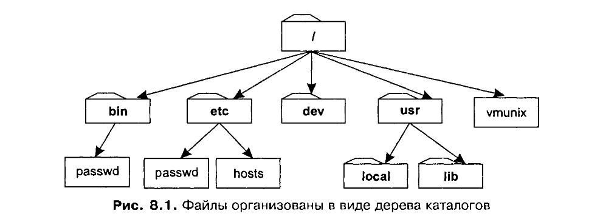
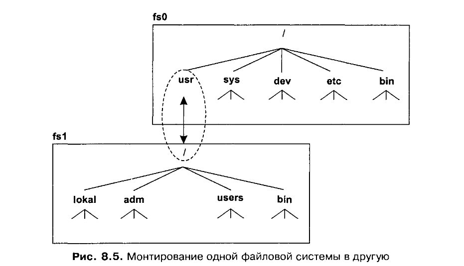

Понятие файла в UNIX распространяется на все сущности, поддерживающие ввод-вывод, в т.ч. каталоги символических ссылок, аппаратные устройства, псевдоустройства и элементы коммуникаций (каналы и сокеты).

`Порт` - аппаратный интерфейс ввода-вывода.

`Драйвер устройства` - программный интерфейс доступа к порту. Драйвер содержит функции для работы с ядром для работы с портами.

`Файл-устройство` - файл, за реализацию операций ввода-вывода для которого отвечает драйвер. Благодаря этому даже с очень разными устройствами процессы могут взаимодействовать через стандартный интерфейс ввода-вывод (write(2), read(2) и др.)

`Псевдоустройство` - виртуальный объект, обслуживаниемый специальным драйвером, поддерживаемым все те же интерфейсы, что и обычный.

**Устройства подразделяются на символьные и блочные**:

* Символьные устройства должны реализовывать базовые функции из структуры struct cdevsw: open, close, read, write и, возможно, другие.
    Структура struct cdevsw хранится в виде глобального массива cdevsw[], который называется `переключателем символьных устройств`.

    Каждое устройство имеет в нём свой уникальный индекс (основной номер устройства) на структуру, содержащую реализованные для этого устройства функции.
    Основной номер устройства хранится в inode символьного устройства.

> Что такое терминал и псевдо-терминал? 

`Терминал` - устройство ввода-вывод для работы с текстовой информацией. 
  
`Псевдотерминал`, как следует из определения устройства, имитирует поведение обычного терминала. Используется для удалённого подключения по ssh и другим протоколам, а также для терминальных сессий.

**Состоит псевдотерминал из двух псевдоустройств:** 

* ведущего /dev/pts/XX
* ведомого /dev/pty/XX 

- подаваемые в ведущий терминал данные будут считываться ведомым и наоборот.
Вводимые с клавиатуры символы идут из ведомого устройства в ведущее, а затем в стандартный поток ввода (дескриптор 1).
Получаемые в потоки вывода и ошибок (дескрипторы 1 и 2) ведущего устройства считываются в ведомом и отображаются в окне псевдотерминала.

-------

**open(2)** открывает файл терминала также, как любой регулярный файл.

`/dev/term/XX` - хранит физические терминалы
`/dev/pty/XX` - хранит псевдотерминалы (причём их ведомую часть)
`/dev/tty` - управляющий терминал текущей сессии

**ioctl(2)** - позволяет отправлять непечатные команды, конфигурировать порты и управлять функциями терминальной дисциплины. Не стандартизирован, поэтому куда предпочтительнее использовать termios(3C) 

**isatty(3F)** - проверяет, относится ли переданный дескриптор к терминалу. Если вернул ненулевое значение, значит это так

**read(2)** - считывает текстовые данные из файла-терминала также, как и из регулярного. Может считать не всю строку либо получить меньше байт, чем запрашивал
    В обычном случае данные при чтении из терминала уничтожаются, то есть повторно они быть прочитанными не могут

**write(2)** - записывает буфер в терминал

**poll(2)** и **select(2)** используются для работы сразу с несколькими устройствами, работа с которыми может привести к блокировке

**close(2)** закрывает дескриптор терминала

**lseek(2)** и **mmap(2)** не поддерживаются терминалами

**libcurses(3LIB)** - бибилиотека для генерации кодов расширения терминала.
    Может с одной стороны, создавать коды расширения для выполнения различных функций, с другой - интерпретировать коды расширения, посылаемые терминалом и переводить их в независимые от конкретной моедли терминала символы
    Тип терминала определён переменной среды TERM.
    Тип сопоставлется с записями в базе данных-катлоге /usr/share/lib/terminfo/. 
      Там хранятся таблицы для всех известных терминалов. В таблицах указаны команды и соответствующие им коды расширения.
    При необходимости libcurses может провести некоторую оптимизацию: 
      Если запрашиваемая команда поддерживается треминалом, библиотека просто вернёт эту команду
      Если команда не поддерживается, библиотека сгенерирует последовательность поддерживаемых команд, приводящую к тому же результату
  В терминале есть 2 очереди ввода и одна вывода.
    Вводимые с клавиатуры символы помещаются в "сырую" очередь. При включённой функции эха направляются в очередь вывода.
    Программы читают строки из канонической очереди ввода. Туда помещаются символы из сырой очереди после ввода переноса строки. 
    Помещаемая в каноническую очередь строка также подвергается дополнительной обработке.
    Каноническая преобработка поддерживает забой и стирание.
    - Забой (ASCII BS / ASCII DEL) - код расширения удалится вместе с идущим перед ним символом (то есть в сыром вводе у нас останется и символ сам символ, и код расширения)
    - Стирание KILL сотрёт всю текущую строку перед собой

**termios(3C)** - универсальный интерфейс для управления терминальными устройствами. Соответствует POSIX

**Структура struct termios содержит поля с флагами, отвечающими за различные параметры терминала:**

    struct termios {
    tcflag_t c_iflag;      // input modes - управление преобработкой ввода
    tcflag_t c_oflag;      // output modes - управелние системной постобработкой вывода
    tcflag_t c_cflag;      // control modes - параметры, отвечавшие за настройку порта RS232 для конкретного терминала. В псевдотерминалах почти ни на что не влияют
    tcflag_t c_lflag;      // local modes - управление разбиением потока на строки, здесь можно отаключить канонический ввод
    cc_t     c_cc[NCCS];   // special characters - коды расширения
    }

**tcflag_t** - битовая маски
Флагов существует огромное множество, для подробного описания целесообразнее смотреть man termios и выбирать флаги под конкретные цели.

**Заслуживающим внимание является настройка параметров терминала для работы с иными устройствами ввода-вывода через порт RS232:**
- Отключить канонический ввод
- Включить обмен восьмибитными данными в обе стороны
- Запретить отображение символов (CR в NL и т.п.) и управление потоком (IXANY и т.п.)
- Выключить эхо
- Устранить значения всех спецсимволов

tcgetattr(int terminalDescriptor, termios_p structPointer)
  записывает по указателю structPointer данные структуры struct termios терминала по переданному дескриптору
tcsetattr(int terminalDescriptor, int when_set, termios_p structPointer)
  сохраняет параметры структуры struct termios по указателю termios_p в терминал по переданному дескриптору. 
  При этом меняться будет не структура file_t, а, собственно, сама vnode, поэтому при экстренном завершении программы терминал может остаться в изменённом состоянии. Починить его можно пытаться командой stty(1)
  when_set указывает, в какой момент необходимо сохранить параметры:
    TCSANOW - немедленно
    TCSADRAIN - когда были переданы все направленные на вывод данные. Следует использовать при изменении флагов c_oflag
    TCSAFLUSH - когда были переданы все направленные на вывод данные и были обработаны все полученные на ввод данные.

**Отличия терминалов и псевдотерминалов**
`Терминал` - электронное печатное устройство.
  
**Что такое сессия?**

`Сессия` - объединение процессов. Лидер сессии - процесс, который создал сессию вызовом setsid. 
Все последующие создаваемые процессом-лидером процессы будут относиться к той же сессии.
Чтобы дать пользователю возможность управлять процессами в сессии. Ей назначается управляющий терминал

**Как терминалы связаны с процессами?**
Управляющий терминал сессии может запускать процессы, которые будут принадлежать к этой сессии. 
Далее терминал может с ними работать: отправлять сигналы, перемещать из группы первого плана и в неё (bg(1), fg(1)).

> Что такое файловая система?

В UNIX понятие `файл` используется для обозначения контейнера для данных. 

`Файловая система` позволяет производить различные действия с файлами и обладать доступом к ним1.

Интерфейс определяет представление файловой системы с точки зрения
пользователя и семантику и действия всех относящихся к ней системных вы-
зовов. Пользователь оперирует лишь некоторыми абстракциями, такими как
*файлы*, *каталоги*, *дескрипторы файлов* и *файловые системы*.

Атрибуты хранятся не в каталоге, а в специальной структуре на диске, называемой обычно `inode`. 

Слово `inode` произошло от сокращения index node, означающего индексный дескриптор файла. Формат и содержимое дескрипторов не совпадает в различных файловых системах. Для вывода атрибутов файла в формате, независимом от файловой системы, используются вызовы stat и fstat. Наиболее общими атрибутами файлов являются:

При вызове функции ореп ядро создает объект открытого файла, соответствующий количеству открытий для этого файла. Ядро также выделяет дескриптор файла, являющийся ссылкой на объект открытого файла. Возвращаемой переменной вызова ореп и является дескриптор открываемого файла. Пользователь может открывать один и тот же файл неоднократно, его могут одновременно открывать и сразу несколько пользователей. В последнем случае ядро системы создаст новые объекты открытого файла и дескрипторы.

*Дескриптор файла является объектом, относящимся к определенному процессу.* Один и тот же дескриптор для двух процессов часто ссылается на разные файлы.

> Файловая система одна?

Файловая иерархия системы UNIX видится как монолитная структура, но в реальности она представляет собой композицию нескольких отдельных деревьев, каждое из которых является отдельной, полной *файловой системой*. Одна из файловых систем настраивается как корневая файловая система, а ее корневой каталог становится системным корневым каталогом. Остальные файловые системы присоединяются к существующей структуре при помощи **монтирования** каждой новой файловой системы в каталог, находящийся в существующем дереве.

Каждая файловая система должна располагаться на отдельном *логическом диске* и ограничивается размером этого диска.

`Логический диск` - это элемент, используемый для хранения информации, видимый ядром системы как линейная последовательность блоков фиксированного размера, доступных в произвольном порядке.

Данные по сокету в диске не располагаются 

Абстрактное описанеи дескрипторов файла.

> Что твкое устройство

Реальное устройство 

> Как терминалы связаны с поцессами

> Процесс демон - 

> Управляющий терминал - 

> Файл это устройство. Под словом файл и под словом устройство, нужно чтобы все друг друга поняли

`Файл-устройство` - специальный файл, не располагаемый в каком-либо произвольном месте файловой системы и ассоциируемый с определенным устройством. По соглашению, все файлы устройств находятся в каталоге /dev или его подкаталогах.

За взаимодействия с устройством всецело отвечает драйвер этого устройства. Каждый драйвер управляет одним или несколькими сходными устройствами. Например, один дисковый драйвер может управлять несколькими дисками. Драйвер является единственным компонентом системы, который владеет информацией об аппаратных характеристиках устройства, таких как количество секторов, дорожек и головок диска или скорости передачи в бодах (baud rates) последовательной линии.

`Драйверы` устройств являются частью ядра и представляют собой набор структур данных и функций, управляющих одним или несколькими устройствами и взаимодействующих с остальной частью ядра посредством определенного интерфейса. 

Драйвер во многом отличается от внутренних компонентов ядра и является обособленным от них. 

`Драйвер` - это единственный модуль ядра, который может взаимодействовать с устройством. 
Драйверы часто создаются 

Демоны — это фоновые процессы, работающие отдельно от терминала и почти всегда созданные процессом init; обычно они занимаются такими вещами, как сетевые запросы, работой аппаратного обеспечения и прочими заданиями типа “жди и смотри”.

Обычно init запускается, когда ядро вызывает конкретный файл, обычно находящийся по адресу /etc/rc или /etc/inittab. Процесс устанавливает путь, проверяет файловую систему, инициализирует серийные порты, задаёт время и т.д. В последнюю очередь он запускает все необходимые фоновые процессы — в виде демонов. Все демоны обычно расположены в папке /etc/init.d/; принято оканчивать имена демонов на букву d (например, httpd, sshd, mysqld и т.п.), поэтому вы можете подумать, что директория названа так по этому же принципу, но на самом деле существует соглашение об именовании папок, содержащих конфигурационные файлы, именем с суффиксом .d. Итак, init запускает демонов, но мы так и не выяснили, как это происходит. Процесс init запускает демонов, создавая свои ответвления для запуска новых процессов.

Типичные задачи демонов: серверы сетевых протоколов (HTTP, FTP, электронная почта и др.), управление оборудованием, поддержка очередей печати, управление выполнением заданий по расписанию и т. д.

ля организации диалоговой работы пользователей в Unix вводится понятие терминальной сессии. С точки зрения пользователя - это процесс работы с текстовым терминалом с момента ввода имени и пароля и до выхода из системы командой logout (exit, нажатие ^D в пустой строке). Во время терминальной сессии может быть запущено несколько программ, которые будут параллельно выполнятся в фоновом режиме и между которыми можно переключаться в диалоговом режиме. После завершения терминальной сессии возможно принудительное завершение всех запущенных в ней фоновых процессов.

С точки зрения ядра - терминальная сессия - это группа процессов, имеющих один идентификатор сеанса sid. С идентификатором sid связан драйвер управляющего терминала, доступный всем членам сеанса как файл символьного устройства /dev/tty. Для каждого сеанса существует свой /dev/tty. Управляющий терминал взаимодействует с процессами сеанса с помощью отправки сигналов.

Терминальная сессия
Физически терминалы обслуживаются демоном ttymon (раньше был getty)

Виртуальные терминалы (сессии) создаются динамически различными сервисами. Например, для сессий терминала ssh создателем будет демон sshd

При входе пользователя создаёт сессия с ID, который равен ID процесса-создателя, проводится авторизация, устанавливается ID пользователя и запускается шелл, шелл берётся из учётной записи пользователя (обычно хранится в /etc/passwd)

Шеллы с управлением заданиями создают на каждую команду группу процессов.

Драйвер tty - это драйвер потока, управляющий физическим соединением с терминалом.

В зависимости от соединения, есть три типа драйверов tty: драйверы асинхронных линий, драйвер pty и драйвер LFT.

Управляющий терминал сессии может запускать процессы, которые будут принадлежать к этой сессии. 
Далее терминал может с ними работать: отправлять сигналы, перемещать из группы первого плана и в неё (bg(1), fg(1)).

**Группы процессов**
Каждый процесс относится к определенной группе процессов, которая идентифицируется через *идентификатор группы процессов* (process group ID). Этот механизм используется ядром для проведения некоторых действий сразу над всеми процессами группы. Каждая группа может иметь лидера. 

`Лидер группы` - это процесс, имеющий PID, совпадающий с идентификатором группы процессов. Обычно процесс наследует идентификатор группы от своего предка, а все остальные процессы в группе являются потомками лидера.

**Управляющий терминал**
Любой процесс может обладать управляющим терминалом. Чаще всего это терминал входа в систему, от которого процесс был создан. Все процессы одной группы разделяют между собой один и тот же управляющий терминал.

**Файл /dev/tty.** 
С управляющим терминалом каждого процесса связан специальный файл /dev/tty. Драйвер устройства, связанный с этим файлом, перенаправляет все запросы на соответствующий терминал.

**Управляющая группа.**
Каждый терминал ассоциируется с группой процессов. Такая группа, называемая управляющей группой терминала, идентифицируется при помощи поля t_pgrp структуры tty этого терминала. 
