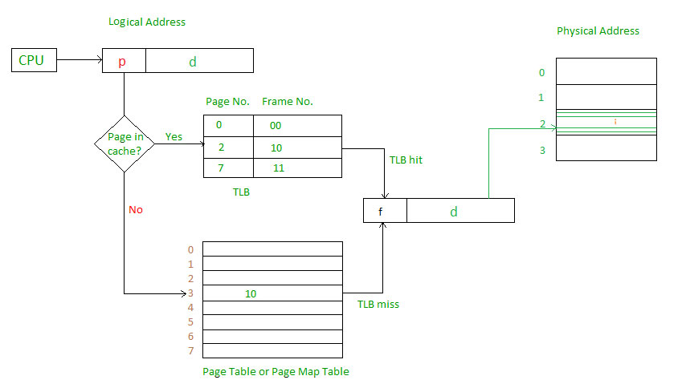

## lab9

> Что такое процесс:

`Процесс` - это нечто выполняющее среду программу и создающее среду ее функционирования.

`Процесс` - это основная единица расписания, так как только один процесс может выполняться в один момент времени занимать процессор. Кроме этого процессор старается перехватить ресурсы системы, такие как различные устройства или память. Он также запрашивает системные *службы*, который выполняются от его имени ядром.

### FORK()

Системный вызов **fork** создает новый процесс, который является почти точной копией его родителя. Единственное различие двух процессов заключается только в необходимости отличать их друг от друга. После возврата из fork процесс-родитель и его потомок выполняют одну и ту же программу (функционирование которой продолжается сразу же вслед за fork) и имеют идентичные области данных и стека. 

**Системный вызов fork во время своей работы должен совершить следующие действия:**

+ зарезервировать пространство свопинга для данных и стека процесса потомка;
+ назначить новый идентификатор PID и структуру рrос потомка;
+ инициализировать структуру рroc потомка. Некоторые поля этой структуры копируются от процесса-родителя (такие как идентификаторы пользователя и группы, маски сигналов и группа процесса), часть полей устанавливается в 0 (время нахождения в резидентном состоянии, использование процессора, канал сна и т. д.), а остальным присваиваются специфические для потомка значения (поля идентификаторов PID потомка и его родителя, указатель на структуру рroc родителя);
+ разместить карты трансляции адресов для процесса-потомка;
+ выделить область и потомка и скопировать в нее содержимое области и процесса-родителя;
+ изменить ссылки области и на новые карты адресации и пространство свопинга;
+ добавить потомка в набор процессов, разделяющих между собой область кода программы, выполняемой процессом-родителем;
+ постранично дублировать области данных и стека родителя и модифицировать карты адресации потомка в соответствии этими новыми стра-
ницами
+ получить ссылки на разделяемые ресурсы, наследуемые потомком, такие как открытые файлы и текущий рабочий каталог;
+ инициализировать аппаратный контекст потомка посредством копирования текущего состояния регистров его родителя;
+ сделать процесс-потомок выполняемым и поместить его в очередь планировщика;
+ установить для процесса-потомка по возврату из вызова fork нулевое значение;
+ вернуть идентификатор PID потомка его родителю.

**Другими словами:**

fork(2)
  pid_t fork(void) - создаёт процесс-потомок копированием текущего процесса. 
    Наследуется всё адресное пространство. При этом используется парадигма copy-on-write, то есть копирование памяти производится только перед первой попыткой записи (кроме сегментов, выделенных с флагом MAP_SHARED)
    В процессе-родителе возвращает PID созданного потомка, в потомке - 0

> Что такое структура proc?

Cостоящий из `структуры рrос` и называемый *таблицей процессов*. Размер этого массива зависит от максимального количества процессов, которые одновременно могут быть запущены в системе. Так как структура рrос находится в системном пространстве, она всегда видна ядру в любой момент времени, даже когда процесс не выполняется.

**Основные поля структуры рrос охватывают:**

+ идентификацию: каждый процесс обладает уникальным идентификатором процесса (process ID, или PID) и относится к определенной группе процессов. В современных версиях системы каждому процессу также
присваивается идентификатор сеанса (session ID);
+ расположение карты адресов ядра для области и данного процесса;
+ текущее состояние процесса;
+ предыдущий и следующий указатели, связывающие процесс с очередью планировщика (или очередью приостановленных процессов, если
данный процесс был заблокирован);
+ канал «сна» для заблокированных процессов (см. раздел 7.2.3);
+ приоритеты планирования задач и связанную информацию (см. главу 5);
+ информацию об обработке сигналов: маски игнорируемых, блокируемых, передаваемых и обрабатываемых сигналов (см. главу 4);
+ информацию по управлению памятью;
+ указатели, связывающие эту структуру со списками активных, свободных или завершенных процессов (зомби);
+ различные флаги;
+ указатели на расположение структуры в очереди хэша, основанной на PID;
+ информация об иерархии, описывающая взаимосвязь данного процесса с другими.

> Что такое свопинг?

`Свопинг (swapping)` – образы процессов выгружаются на диск и возвращаются в оперативную память целиком;

### EXEC

**ЛЕКЦИЯ(худ. литература):**
Если мы не передаём новое окружение, то программе будет передано окружение родителя.

execvpe и execlpe не определены, потому что не ясно, из какого окружения надо брать пути PATH.

Фактически, exec заменяет образ процесса:

* зачастую не затрагивает user area
* наследует открытие дескрипторы файлов, кроме тех, для которых мы это явно запретили, поставив CLOEXEC
* Наследует захваченные участки файлов
* euid/egid будут наследоваться, если исполняемый файл не setuid/setgid

Системный вызов ехес заменяет адресное пространство вызывающего процесса на адресное пространство новой программы. Если процесс был создан при помощи vfork, то вызов ехес возвращает старое адресное пространство родительскому процессу. В ином случае этот вызов высвобождает старое адресное пространство. Вызов ехес предоставляет процессу новое адресное пространство и загружает в него содержимое новой программы. По окончании работы ехес процесс продолжает выполнение с первой инструкции новой программы.

**Системный вызов ехес выполняет следующие действия:**

1. Разбирает путь к исполняемому файлу и осуществляет доступ к нему.
2. Проверяет, имеет ли вызывающий процесс полномочия на выполнение файла.
3. Читает заголовок и проверяет, что он действительно исполняемый.
4. Если для файла установлены биты SUID или SGID, то эффективные идентификаторы UID и GID вызывающего процесса изменяет на UID и GID, соответствующие владельцу файла.
5. Копирует аргументы, передаваемые в **ехес**, а также переменные среды в пространство ядра, после чего текущее пользовательское пространство готово к уничтожению.
6. Выделяет пространство свопинга для областей данных и стека.
7. Высвобождает старое адресное пространство и связанное с ним пространство свопинга. Если же процесс был создан при помощи **vfork**, производится возврат старого адресного пространства родительскому процессу.
8. Выделяет *карты трансляции* адресов для нового текста, данных и стека.
9. Устанавливает новое адресное пространство. Если область текста активна (какой-то другой процесс уже выполняет ту же программу), то она будет совместно использоваться с этим процессом. В других случаях пространство должно инициализироваться из выполняемого файла. Процессы в системе UNIX обычно разбиты на страницы, что означает, что каждая страница считывается в память только по мере необходимости.
10. Копирует аргументы и переменные среды обратно в новый стек приложения.
11. Сбрасывает все обработчики сигналов в действия, определенные по умолчанию, так как функции обработчиков сигналов не существуют в новой программе. Сигналы, которые были проигнорированы или заблокированы перед вызовом **ехес**, остаются в тех же состояниях.
12. Инициализирует аппаратный контекст. При этом большинство регистров сбрасывается в 0, а указатель команд получает значение точки входа программы.

### WAIT

Системный вызов **wait** позволяет процессу ожидать завершения работы его потомка. Так как потомок может уже оказаться завершенным к моменту совершения вызова, то ему необходимо уметь распознавать такую ситуацию. После запуска вызов **wait** первоначально проверяет, имеет ли вызывающий его процесс потомков,  ункционирование которых завершено или приостановлено. Если он находит такие процессы, то немедленно происходит возврат из этого системного вызова. Если таких процессов нет, то **wait** блокирует вызвавший его процесс до тех пор, пока один из потомков не завершит свою работу, после чего последует возврат из вызова. В обоих случаях вызов **wait** возвратит PID завершившегося процесса, запишет его статус выхода в **stat_loc** и освободит его структуру ргос (если более одного процесса-потомка завершили свою работу, **wait** обработает только первый из найденных).  Ошибку **wait** вернет в случае, когда родительский процесс не имеет ни одного потомка (функционирующего или уже завершенного) либо если его работа была прервана поступившим сигналом.

### EXIT

Функция ядра `exit()` предназначена для завершения процесса. 

Она вызывается изнутри, когда процесс завершается по сигналу. С другой стороны, программа может выполнить системный вызов exit, который, в свою очередь, вызовет функцию **exit()**. 

**Функция **exit()** производит следующие действия:**

1. Отключает все сигналы.
2. Закрывает все открытые файлы.
3. Освобождает файл программы и другие ресурсы, например текущий каталог.
4. Делает запись в журнал данной учетной записи.
5. Сохраняет данные об использованных ресурсах и статус выхода в структype proc.
6. Изменяет состояние процесса на SZOMB (зомби) и помещает его структуру рrос в список процессов-зомби.
7. Устанавливает процесс **init** любому существующему потомку завершаемого процесса в качестве родителя.
8. Освобождает адресное пространство, область U, карты трансляции адресов и пространство свопинга.
9. Посылает родителю завершаемого процесса сигнал SIGCHLD. Этот сигнал обычно игнорируется и реально необходим только в тех случаях, если по какой-то причине родительскому процессу необходимо знать о завершении работы его потомка.
10. Будит родительский процесс, если тот был приостановлен.
11. Вызывает **swtch()** для перехода к выполнению следующего процесса в расписании.
12. После завершения работы **exit()** процесс находится в состоянии зомби. Вызов **exit** не освобождает структуру рrос завершенного процесса, так как его родителю, возможно, будет необходимо получить статус выхода и информацию об использовании ресурсов. За освобождение структуры ргос потомка отвечает его  роцесс-родитель, как будет описано подробнее позже. По завершении этой процедуры структура ргос возвращается в список свободных структур, и на этом процесс «чистки следов» завершается.

> Процесс приостанавливается?

Ядро его блокирует и ставит в очередь.

> Что такое системный вызов?

Обертка для выполнения кода в ядре.

> Что такое область **U**

`Область U` - структура данных, содержащая нужную ядру информацию о процессе, такую как таблицу файлов, открытых процессом, данные для идентификации, а также сохраненные значения регистров процесса, пока процесс не является текущим.Процесс не может произвольно изменять эту информацию - и, следовательно, область и является защищенной от доступа в режиме задачи (некоторые реализации ОС позволяют процессу считывать эту информацию, но не изменять ее).

> Что такое файл?

`Файл` - единица файловой системы.

> Что такое файловая системв?

`Файловая система` - порядок, определяющий способ организации, хранения и именования данных на носителях информации в компьютерах, а также в другом электронном оборудовании. Файловая система определяет формат содержимого и способ физического хранения информации, которую принято группировать в виде файлов.

> Что такое дескриптор?

> Вы: просто инт. 

Чтобы не ограничиваться количеством регистров MMU, выделили в памяти область под таблицы трансляции. В них также хранятся селекторы, права доступа, базовый адрес и размер области. Теперь MMU Достаточно хранить адрес таблицы трансляции - всё это в целом называется дескриптором

> Как виртуальные адреса транслируются физически

Через MMU. 

`MMU` - memory management unit - Аппаратно реализованный блок управления памятью.

> Файловая система - набор операций действие на файлами

> ЧТо ноужно, чтобы создать файловую систему

Выделить лог диск. VNODE. Методы работы с файлами.

> tlb - translation lookup buffer? 

Буфер трансляции (translation lookaside buffer, TLB) - это кэш-память, в которой хранятся последние трансляции виртуальной памяти в физическую. Он используется для уменьшения времени доступа к пользовательской ячейке памяти[1] и может называться адресно-трансляционным кэшем. Он является частью блока управления памятью (MMU) микросхемы. TLB может располагаться между процессором и кэшем процессора, между кэшем процессора и основной памятью или между различными уровнями многоуровневого кэша. Большинство процессоров для настольных ПК, ноутбуков и серверов включают один или несколько TLB в состав аппаратных средств управления памятью, и они практически всегда присутствуют в любом процессоре, использующем страничную или сегментированную виртуальную память.

