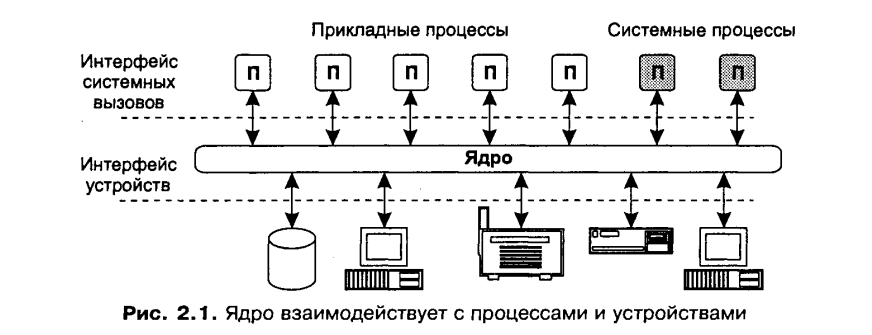
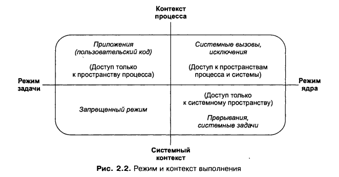
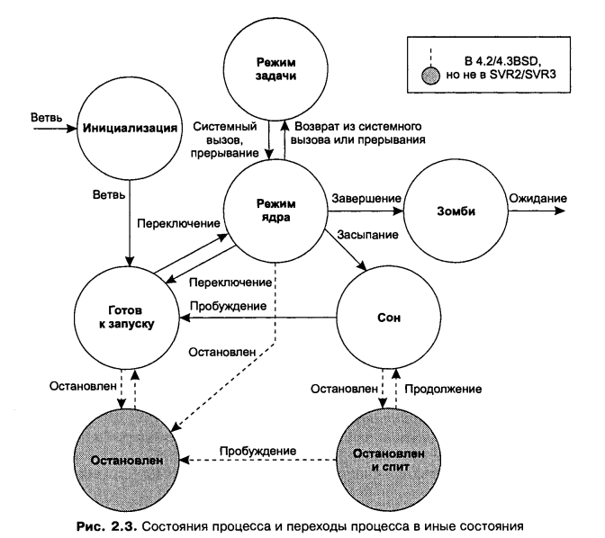
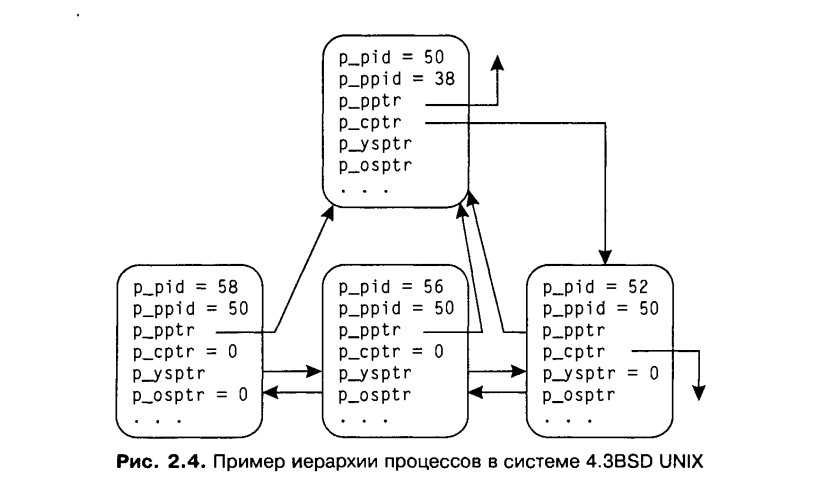

Операционные системы
===

# Конспект Книги "UNIX изнутри" Вахалия

## 1. Введение

`Традиционное ядро UNIX:`
* Файловая система (s5fs)
* Виртуальная память
* Загрузчик (a. out)
* Переключатель блочных устройств
    * Драйвер диска
    * Драйвер накопителя на магнитных лентах
* Переключатель символьных устройств
    * Драйвер принтера
    * Сетевой драйвер
    * Драйвер терминала

## 2.1 Ядро и процессы

### Процесс и адресное пространство.
Среда приложений системы UNIX основана на фундаментальной абстракции - *процессе*. В традиционных системах процесс выполняет единую последовательность инструкций в адресном пространстве. 

`Адресное пространство` процесса представляет собой набор адресов памяти, к которым тот имеет
доступ и на которые может ссылаться.
Адресное пространство процесса является виртуальным, и обычно только часть его соответствует участкам в физической памяти. Ядро хранит содержимое адресного пространства процесса в различных объектах хранения, в том числе в физической памяти, файлах на диске, а также в специально зарезервированных *областях свопинга (swap areas)*, находящихся на локальных или удаленных дисках. Подсистема управления памятью ядра переключает страницы (блоки фиксированного размера) памяти процесса между этими объектами по мере необходимости.

Процесс отслеживает последовательность выполняемых инструкций при помощи *контрольной точки*, используя аппаратный регистр, обычно называемый *указателем (счетчиком) команд*.

Система UNIX является многозадачной. Это означает, что в ней одновременно функционируют несколько процессов. Для этих процессов система обеспечивает некоторые свойства виртуальной машины. В классической архитектуре виртуальной машины операционная система создает каждому процессу иллюзию того, что он является единственной задачей, выполняемой в данное время. Программист пишет приложение так, как будто только его код будет выполняться системой. В системах UNIX каждый процесс имеет
собственные регистры и память, однако для операций ввода-вывода и взаимодействия с устройствами должен полагаться на операционную систему.

`Свопинг (swapping)` – образы процессов выгружаются на диск и возвращаются в оперативную память целиком;
`Виртуальная память (virtual memory)` – между оперативной памятью и диском перемещаются части образов (сегменты, страницы, блоки и т.п.) процессов.
`Регистры`  - внутренние ячейки процессора, которые служат для хранения информации с практически мгновенным доступом. В отличии от оперативной памяти, для чтения и записи в регистры не нужно обращаться к внешнему устройству через шину, потому что регистры встроены в процессор и являются одной из его основных частей.

С одной стороны, `операционная система` - это программа (часто называемая
ядром), которая управляет аппаратурой, создает, уничтожает все процессы
и управляет ими. Если рассматривать шире, `операционная система`
не только включает в себя ядро, но является также основой функционирова-
ния остальных программ и утилит (командных интерпретаторов, редакто-
ров, компиляторов, программ типа date, ls, who и т. д.), составляющих вместе
пригодную для работы среду. 

### Ядро
Ядро само по себе мало пригодно для исполь-
зования. Пользователи, приобретающие систему UNIX, ожидают получить
вместе с ней большой набор дополнительных программ. Однако ядро, тем не
менее, является весьма специфичной программой по многим причинам. Оно
определяет программный интерфейс системы. 

`Ядро` - это единственная программа, являющаяся необходимой, без которой ничего не будет работать.
`Ядро` - это специальная программа, работающая непосредственно с аппаратурой.

Ядро находится на диске в файле, обычно имеющем название */vmunix* или */unix* (в зависимости от производителя ОС). Когда система стартует, с диска загружается ядро при помощи специальной процедуры начальной загрузки (bootstrapping). Ядро инициализирует систему и устанавливает среду для выполнения процессов. Затем создаются несколько начальных процессов, которые в дальнейшем порождают остальные процессы. После загрузки ядро находится в памяти постоянно до тех пор, пока работа системы не будет завершена.

------
Операционная система UNIX обеспечивает свою функциональность четырьмя различными способами:
+ Прикладные процессы запрашивают от ядра необходимые службы при помощи *интерфейса системных вызовов* (см. рис. 2.1), являющегося центральным компонентом API системы UNIX. Ядро выполняет эти
запросы от имени вызывающих процессов.
+ Некоторые некорректные действия процесса, такие как попытки деления на ноль или переполнение стека процесса, являются причиной *аппаратных исключений*. Возникающие ошибки требуют вмешательства
ядра, после чего происходит их обработка от имени процесса.
+ Ядро обрабатывает аппаратные *прерывания* от периферийных устройств. Устройства используют механизм прерываний для оповещения ядра об окончании процесса ввода-вывода или изменении состояния. Ядро
трактует прерывания как глобальные события, не относящиеся к какому-то одному определенному процессу.
+ Набор специальных системных процессов, таких как *swapper* или *pagedaemon*, занимается выполнением обширных системных задач, таких как управление рядом активных процессов или поддержка пула
свободной памяти.

## 2.2 Режим, пространство и контекст

Для возможности функционирования системы UNIX аппаратная часть компьютера должна поддерживать по крайней мере два режима выполнения: более привилегированный *режим ядра* и менее привилегированный *режим задачи*. Ядро защищает часть адресного пространства от доступа в режиме задачи. Более того, наиболее привилегированные машинные инструкции могут выполняться только в режиме ядра. Главной причиной появления различных режимов выполнения является безопасность. Если пользовательские
процессы выполняются в менее привилегированном режиме, то они не могут случайно или специально повредить другой процесс или ядро системы. 

`Режим ядра` - более привилигированный режим выполнения, привилигированный в смысле большей свободы во взаимодействием с ресурсами ОС.
`Режим задачи` - менее привилигированный режим выполнения, привилигированный в смысле большей свободы во взаимодействием с ресурсами ОС.

Большинство реализаций UNIX используют *виртуальную память*. В системе виртуальной памяти адреса, выделенные программе, не ссылаются непосредственно на физическое размещение в памяти. Каждому процессу предоставляется собственное *виртуальное адресное пространство*, а ссылки на
виртуальные адреса памяти транслируются в их фактическое нахождение в физической памяти при помощи набора *карт трансляции адресов*.

Многие системы реализуют такие карты как *таблицы страниц*, с одной записью для
каждой страницы адресного пространства процесса (`страница` - это выделенный и защищенный блок памяти фиксированного размера). Аппаратно реализованный блок управления памятью (memory management unit, MMU)
обычно обладает определенным набором регистров для определения карт трансляции адресов процесса, выполняющегося в данный момент времени (также называемого *текущим*).

`MMU` - memory management unit - Аппаратно реализованный блок управления памятью.

Когда текущий процесс уступает процессорное время другому процессу (*переключение контекста*), ядро размещает в этих регистрах указатели на карты трансляции адресов нового процесса. Регистры MMU являются привилегированными и могут быть доступны только в режиме ядра. Это дает гарантию того, что процесс будет ссылаться на адреса памяти только своего адресного пространства и не имеет доступа или возможности изменения адресного пространства другого процесса.

`Пространство ядра` - определенная часть виртуального адресного пространства каждого процесса отображается на код и структуры данных ядра.

Определенная часть виртуального адресного пространства каждого процесса отображается на код и структуры данных ядра. Эта часть называется *системным пространством* или *пространством ядра* и может быть доступна только в режиме ядра. В системе может одновременно выполняться только одна копия ядра, следовательно, все процессы отображаются в единое адресное пространство ядра. **В ядре содержатся глобальные структуры и информация, дающая возможность ему иметь доступ к адресному пространству любого процесса** Ядро может обращаться к адресному пространству текущего процесса напрямую, так как регистры MMU хранят всю необходимую для этого информацию. Иногда ядру требуется обратиться к адресному пространству, не являющемуся в данный момент текущим. В этом случае обращение происходит не непосредственно, а при помощи специального временного отображения.

В то время как ядро совместно используется всеми процессами, системное пространство защищается от доступа в режиме задачи. **Процессы не могут напрямую обращаться к ядру и должны использовать для этого *интерфейс системных вызовов***. После того как процесс производит системный вызов, запускается специальная последовательность команд (называемая переключателем режимов), переводящая систему в режим ядра, а управление передается ядру, которое и обрабатывает операцию от имени процесса. По-
сле завершения обработки системного вызова ядро вызывает другую последовательность команд, возвращающую систему обратно в режим задачи (производится еще одно переключение режима), и снова передает управление текущему процессу. Интерфейс системных вызовов описан подробнее в разлеле 2.4.1.

-------

Существуют два важных для любого процесса объекта, которые управляются ядром. Они обычно реализуются как часть адресного пространства процесса. Это *область U* (u-агеа, или user-агеа) и *стек ядра* (kernel stack). 

`Область U` - структура данных, содержащая нужную ядру информацию о процессе, такую как таблицу файлов, открытых процессом, данные для идентификации, а также сохраненные значения регистров процесса, пока процесс не является текущим.Процесс не может произвольно изменять эту информацию - и, следовательно, область и является защищенной от доступа в режиме задачи (некоторые реализации ОС позволяют процессу считывать эту информацию, но не изменять ее).

Ядро системы UNIX является *реентерабельным*, то есть к ядру могут обращаться одновременно несколько процессов. Фактически они могут выполнять одни и те же последовательности инструкций параллельно. (Разумеется, в один момент времени выполняется только один процесс, остальные при этом заблокированы или находятся в режиме ожидания1.) Таким образом каждому процессу необходим собственный стек ядра для хранения данных, используемых последовательностью функций ядра, инициированной вызовом из процесса. Многие реализации UNIX располагают стек ядра в адресном пространстве каждого процесса, но при этом запрещают к нему доступ в режиме задачи. Концептуально область и и стек ядра хоть и создаются для
каждого процесса отдельно и хранятся в его адресном пространстве, они, тем не менее, являются *собственностью* ядра.

`Реентерабельностью` называется возможность единовременного обращения различных про-
цессов к одному и тому же машинному коду, загруженному в память компьютера в единствен-
ном экземпляре.

### Контекст выполнения

Разделяют 2 вида:

1. Системный контекс.
    Если ядро функционирует в системном контексте, то оно не должно иметь доступа к адресному пространству, области и и стеку ядра текущего процесса. Ядро также не должно в этом режиме блокировать процессы, так как это приведет к блокировке «невинного» процесса.
2. Контекст процесса.
    Ядро функционирует от имени текущего процесса (например, пока обрабатывает системный вызов) и может иметь доступ и изменять адресное пространство, область и и стек ядра этого процесса. Более того, ядро может заблокировать текущий процесс, если тому необходимо ожидать освобождения ресурса или реакции устройства.

Ядро также должно выполнять глобальные задачи, такие как обслуживание прерываний устройств и пересчет приоритетов процессов. Такие задачи не зависят от какого-либо конкретного процесса и, следовательно, обрабатываются в системном контексте (также называемом контекстом прерываний).

## 2.3 Определение процесса.

`Процесс` - это нечто выполняющее среду программу и создающее среду ее функционирования.

`Процесс` - это основная единица расписания, так как только один процесс может выполняться в один момент времени занимать процессор. Кроме этого процессор старается перехватить ресурсы системы, такие как различные устройства или память. Он также запрашивает системные *службы*, который выполняются от его имени ядром.

### Время жизни:

Создаются при помощи системного вызова fork или vfork и работают до тех пор, пока не будет завершены вызовом exit. Во время функционирования процесс может запускать одну или несколько программ, для запуска используется системный вызов exec.

### Родительские и дочерние процессы.

В системе UNIX процессы иерархически строго упорядочены. Каждый процесс имеет одного *родителя* (parent, или родительский процесс) и может иметь также одного или нескольких *потомков* (child, или процесс-потомок).

Иерархия процессов может быть представлена как перевернутое дерево, в вершине (основании) которого находится процесс init. Процесс init (названный так в силу того, что он запускает программу /etc/init) является первым прикладным процессом, создаваемым во время загрузки системы. Этот процесс порождает все остальные прикладные процессы.

Если какой-либо процесс завершен и после него остаются функционирующие процессы-потомки, то они становятся *«осиротевшими» (orphan)* и наследуются процессом init.

### 2.3.1 Состояния процесса

Системный вызов **fork** создает процесс, который начинает свой жизненный цикл в *начальном* состоянии, также называемом *переходным (idle)*. После того как создание процесса завершится, вызов fork переводит его в состояние *готовности к работе (ready to run)*, в котором процесс ожидает своей очереди на обслуживание. В какой-то момент времени ядро выбирает этот процесс для выполнения и инициирует переключение контекста. Это производится вызовом процедуры ядра (обычно называемой swtch), которая загружает аппаратный контекст процесса (см. раздел 2.3.2) в системные регистры и передает ему управление. Начиная с этого момента новый процесс ведет себя так же, как и любой другой. Последующие изменения его состояния описаны ниже.

### 2.3.2 Контекст процесса

* **Адресное пространство задачи.** Обычно делится на несколько составляющих:
  - текст программы(выполняемый код)
  - данные
  - стек задачи
  - совместно используемые области памяти
* **Управляющая информация.** Каждый процесс обладает собственным стеком ядраи картами трансляции адресов. Ядро использует для поддержки управляющей информации две основные структуры:
  - область U
  - структуру proc 
* **Полномочия.** Включают в себя идентификаторы пользователя и группы, ассоциируемые с данным процессом (которые будут описаны в разделе 2.3.3).
* **Переменные окружения.** Это набор строк в форме:  переменная=значение  . Переменные окружения наследуются от родительского процесса. Во многих вариантах UNIX такие строки хранятся в вершине стека. Стандартные пользовательские библиотеки имеют функции для добавления, удаления или изменения переменных, а также для возврата ее значения. При запуске новой программы вызывающий процесс может сообщить функции ехес о том, что переменные окружения должны остаться «родительскими» или вместо этого предложить новый набор переменных.
* **Аппаратный контекст.** Включает содержимое регистров общего назначения, а также набора специальных системных регистров. Системные регистры содержат:
  - **Программный счетчик** (program counter, PC). Хранит адрес следующей выполняемой инструкции.
  - **Указатель стека** (stack pointer, SP). Содержит адрес верхнего элемента стека.
  - **Слово состояния процессора** (processor status word, PSW). Содержит несколько битов с информацией о состоянии системы, в том числе о текущем и предыдущем режимах выполнения, текущем и предыдущем уровнях приоритетов прерываний, а также биты переполнения и переноса.
  - **Регистры управления памятью**, в которых отображаются таблицы трансляции адресов процесса.
  - **Регистры сопроцессора** (Floating point unit, FPU).

### Полномочия пользователя

`Идентификатор пользователя` - свой уникальный номер. Определяют принадлежность файлов, права доступа, а также возможность посылки сигналов другим процессам. Все перечисленные атрибуты получили единое название *полномочий*. 

Каждый пользователь системы имеет свой уникальный номер, называемый *идентификатором пользователя* (user ID, или UID). Системный администратор обычно также создает несколько различных групп пользователей, каждая из которых обладает *уникальным идентификатором группы* (user group ID, или GID). Эти идентификаторы определяют принадлежность файлов, права доступа, а также возможность посылки сигналов другим процессам. Все перечисленные атрибуты получили единое название *полномочий*. 

Система различает *привилегированного пользователя*, называемого *суперпользователем* (superuser), который обычно входит в систему под именем **root**. Этот пользователь имеет UID, равный 0, и GID, равный 1. Он обладает многими подномочиями, недоступными обычным пользователям. Он может иметь доступ к чужим файлам независимо от установок их защиты, а также выполнять ряд привилегированных системных вызовов (например, mknod, используемый для создания специальных файлов устройств). Многие современные системы UNIX, такие как SVR4.1/ES, поддерживают *расширенные механизмы защиты* [8]. В этих системах поддержка суперпользователя заменена разделением привилегий при проведении различных операций. 

Каждый процесс обладает двумя идентификаторами пользователя - *реальным (real)* и *действительным (effective)*. После того как пользователь входит в систему, программа входа в систему выставляет обеим парам UID и GID значения, определенные в базе паролей (то есть в файле **/etc/passwd** или в некоем распределенном механизме, например службе NIS корпорации Sun Microsystems). Когда процесс создается при помощи fork, потомок наследует полномочия от своего прародителя. 

*Есть еще третий - сохраненный (saved).*

> Говоря в общем, реальный идентификатор пользователя (или группы) сообщает, кто создал процесс, а эффективный идентификатор пользователя (или группы) сообщает от чьего лица выполняется процесс, если эта информация изменяется.

------
Эффективный UID и эффективный GID влияют на создание файлов и доступ к ним. Во время создания файла ядро устанавливает ему атрибуты владельца файла как эффективные UID и GID процесса, из которого был сделан вызов на создание файла. Во время доступа процесса к файлу ядро использует эффективные идентификаторы процесса для определения, имеет ли он право обращаться к этому файлу (подробнее см. раздел 8.2). 

------
Реальный UID и реальный GID идентифицируют владельца процесса и влияют на право отправки
сигналов. Процесс, не имеющий привилегий суперпользователя, может передавать сигналы другому процессу только в том случае, если реальный или эффективный UID отправителя совпадает с реальным UID получателя.

Существуют три различных системных вызова, которые могут переопределять полномочия. Если процесс вызывает ехес для выполнения программы, установленной в режиме suid (см. раздел 8.2.2), то ядро изменяет эффективный UID процесса на UID, соответствующий владельцу файла программы. Точно так же, если программа установлена в режиме sgid, ядро изменяет GID вызываемого процесса.

Система UNIX предлагает описанную возможность с целью предоставления специальных прав пользователям для определенных целей. Классическим примером такого подхода является программа **passwd**, позволяющая пользователям изменять свои пароли. Этой программе необходимо записать результат в базу данных паролей, которая обычно недоступна пользователям для прямых изменений (с целью защиты от модификаций записей других пользователей). Таким образом, владельцем **passwd** является суперпользователь, но программа имеет установленный бит SUID. Это дает возможность обычному пользователю получить привилегии суперпользователя на время и в рамках выполнения программы **passwd**.

Пользователь также может настраивать свои полномочия при помощи системных вызовов **setuid** и **setgid**. Суперпользователю позволено при помощи этих вызовов изменять как реальные, так и эффективные идентификаторы UID и GID. Обычные пользователи могут обращаться к этим вызовам только для изменения своих эффективных идентификаторов UID или GID на реальные.

### 2.3.4 Область U и структура proc

В различных реализациях UNIX ядро имеет массив фиксированного размера, состоящий из структур рrос и называемый *таблицей процессов*. Размер этого массива зависит от максимального количества процессов, которые одновременно могут быть запущены в системе. Так как структура рrос находится в системном пространстве, она всегда видна ядру в любой момент времени, даже когда процесс не выполняется.

Область U является частью пространства процесса. Это означает, что она отображаема и видима только в тот период времени, когда процесс выполняется. Одной из задач переключателя контекста является сброс этого отображения, с тем чтобы ядро через переменную и «добралось» до физического расположения новой области U.

**Основные поля области U перечислены ниже:**

+ блок управления процессом используется для хранения аппаратного контекста в то время, когда процесс не выполняется;
+ указатель на структуру рrос для этого процесса;
+ реальные и эффективные UID и GID;
+ входные аргументы и возвращаемые значения (или коды ошибок) от текущего системного вызова;
+ обработчики сигналов и информация, связанная с ними (см. главу 4);
+ информация из заголовка программы, в том числе размеры текста, данных и стека, а также иная информация по управлению памятью;
+ таблица дескрипторов открытых файлов (см. раздел 8.2.3). Современные системы UNIX, такие как SVR4, расширяют эту таблицу динамически по мере необходимости;
+ указатели на vnode. Объекты vnode представляют собой объекты файловой системы и будут подробнее описаны в разделе 8.7;
+ статистика использования процессора, информация о профиле процесса, дисковых квотах и ресурсах;
+ во многих реализациях UNIX стек ядра процесса является частью области и этого процесса.
Основные поля структуры рrос охватывают:
+ идентификацию: каждый процесс обладает уникальным идентификатором процесса (process ID, или PID) и относится к определенной группе процессов. В современных версиях системы каждому процессу также
присваивается идентификатор сеанса (session ID);
+ расположение карты адресов ядра для области и данного процесса;
+ текущее состояние процесса;
+ предыдущий и следующий указатели, связывающие процесс с очередью планировщика (или очередью приостановленных процессов, если
данный процесс был заблокирован);
+ канал «сна» для заблокированных процессов (см. раздел 7.2.3);
+ приоритеты планирования задач и связанную информацию (см. главу 5);
+ информацию об обработке сигналов: маски игнорируемых, блокируе-
мых, передаваемых и обрабатываемых сигналов (см. главу 4);
+ информацию по управлению памятью;
+ указатели, связывающие эту структуру со списками активных, свободных или завершенных процессов (зомби);
+ различные флаги;
+ указатели на расположение структуры в очереди хэша, основанной на PID;
+ информация об иерархии, описывающая взаимосвязь данного процесса с другими.

- p_pid - идентификатор процесса
- p_ppid - идентификатор родительского процесса
- p_pptr - указатель на структуру proc родителя
- p_cptr - указатель на старшего потомка
- p_ysptr - указатель на следующий младщий процесс того же уровня
- p_osptr - указатель на следующий старший процесс того же уровня

## Выполнение в режиме ядра

Существуют три различных типа событий, которые могут перевести систему в режим ядра:

* Прерывания устройств (interrups)
* Исключения (exceptions)
* Ловушки (traps)