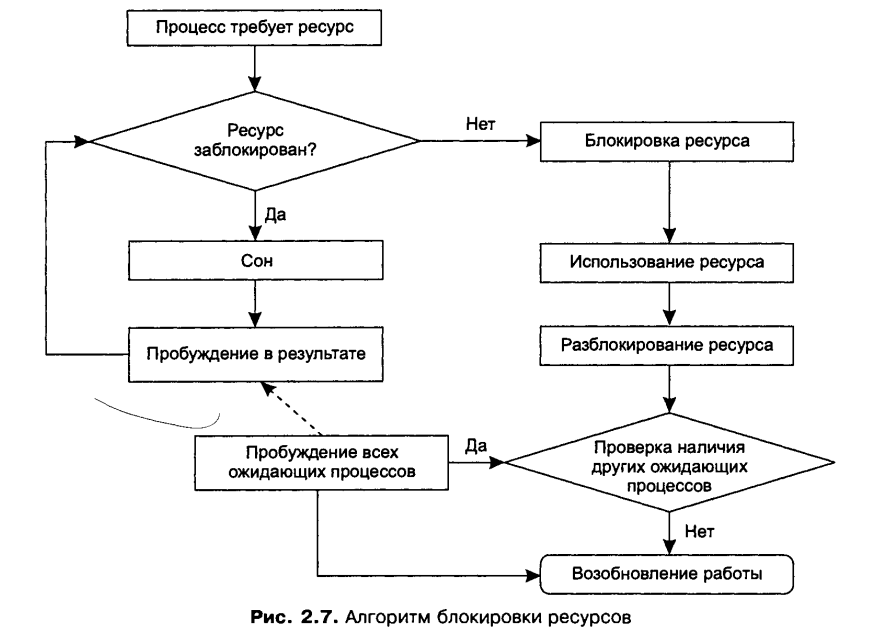
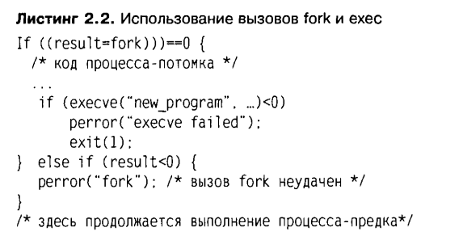

Операционные системы
===

# Конспект Книги "UNIX изнутри" Вахалия

# 1. Введение

`Традиционное ядро UNIX:`
* Файловая система (s5fs)
* Виртуальная память
* Загрузчик (a. out)
* Переключатель блочных устройств
        * Драйвер диска
        * Драйвер накопителя на магнитных лентах
* Переключатель символьных устройств
        * Драйвер принтера
        * Сетевой драйвер
        * Драйвер терминала

# Глава 2. Ядро и процессы

## 2.1 Ядро и процессы

### Процесс и адресное пространство.
Среда приложений системы UNIX основана на фундаментальной абстракции - *процессе*. В традиционных системах процесс выполняет единую последовательность инструкций в адресном пространстве. 

`Адресное пространство` процесса представляет собой набор адресов памяти, к которым тот имеет
доступ и на которые может ссылаться.
Адресное пространство процесса является виртуальным, и обычно только часть его соответствует участкам в физической памяти. Ядро хранит содержимое адресного пространства процесса в различных объектах хранения, в том числе в физической памяти, файлах на диске, а также в специально зарезервированных *областях свопинга (swap areas)*, находящихся на локальных или удаленных дисках. Подсистема управления памятью ядра переключает страницы (блоки фиксированного размера) памяти процесса между этими объектами по мере необходимости.

Процесс отслеживает последовательность выполняемых инструкций при помощи *контрольной точки*, используя аппаратный регистр, обычно называемый *указателем (счетчиком) команд*.

Система UNIX является многозадачной. Это означает, что в ней одновременно функционируют несколько процессов. Для этих процессов система обеспечивает некоторые свойства виртуальной машины. В классической архитектуре виртуальной машины операционная система создает каждому процессу иллюзию того, что он является единственной задачей, выполняемой в данное время. Программист пишет приложение так, как будто только его код будет выполняться системой. В системах UNIX каждый процесс имеет
собственные регистры и память, однако для операций ввода-вывода и взаимодействия с устройствами должен полагаться на операционную систему.

`Свопинг (swapping)` – образы процессов выгружаются на диск и возвращаются в оперативную память целиком;
`Виртуальная память (virtual memory)` – между оперативной памятью и диском перемещаются части образов (сегменты, страницы, блоки и т.п.) процессов.
`Регистры`    - внутренние ячейки процессора, которые служат для хранения информации с практически мгновенным доступом. В отличии от оперативной памяти, для чтения и записи в регистры не нужно обращаться к внешнему устройству через шину, потому что регистры встроены в процессор и являются одной из его основных частей.

С одной стороны, `операционная система` - это программа (часто называемая ядром), которая управляет аппаратурой, создает, уничтожает все процессы и управляет ими. Если рассматривать шире, `операционная система` не только включает в себя ядро, но является также основой функционирования остальных программ и утилит (командных интерпретаторов, редакторов, компиляторов, программ типа date, ls, who и . д.), составляющих вместе пригодную для работы среду. 

### Ядро
Ядро само по себе мало пригодно для исполь-
зования. Пользователи, приобретающие систему UNIX, ожидают получить
вместе с ней большой набор дополнительных программ. Однако ядро, тем не
менее, является весьма специфичной программой по многим причинам. Оно
определяет программный интерфейс системы. 

`Ядро` - это единственная программа, являющаяся необходимой, без которой ничего не будет работать.
`Ядро` - это специальная программа, работающая непосредственно с аппаратурой.

Ядро находится на диске в файле, обычно имеющем название */vmunix* или */unix* (в зависимости от производителя ОС). Когда система стартует, с диска загружается ядро при помощи специальной процедуры начальной загрузки (bootstrapping). Ядро инициализирует систему и устанавливает среду для выполнения процессов. Затем создаются несколько начальных процессов, которые в дальнейшем порождают остальные процессы. После загрузки ядро находится в памяти постоянно до тех пор, пока работа системы не будет завершена.

------
**Операционная система UNIX обеспечивает свою функциональность четырьмя различными способами:**

+ Прикладные процессы запрашивают от ядра необходимые службы при помощи *интерфейса системных вызовов* (см. рис. 2.1), являющегося центральным компонентом API системы UNIX. Ядро выполняет эти
запросы от имени вызывающих процессов.
+ Некоторые некорректные действия процесса, такие как попытки деления на ноль или переполнение стека процесса, являются причиной *аппаратных исключений*. Возникающие ошибки требуют вмешательства
ядра, после чего происходит их обработка от имени процесса.
+ Ядро обрабатывает аппаратные *прерывания* от периферийных устройств. Устройства используют механизм прерываний для оповещения ядра об окончании процесса ввода-вывода или изменении состояния. Ядро
трактует прерывания как глобальные события, не относящиеся к какому-то одному определенному процессу.
+ Набор специальных системных процессов, таких как *swapper* или *pagedaemon*, занимается выполнением обширных системных задач, таких как управление рядом активных процессов или поддержка пула
свободной памяти.

## 2.2 Режим, пространство и контекст

Для возможности функционирования системы UNIX аппаратная часть компьютера должна поддерживать по крайней мере два режима выполнения: более привилегированный *режим ядра* и менее привилегированный *режим задачи*. Ядро защищает часть адресного пространства от доступа в режиме задачи. Более того, наиболее привилегированные машинные инструкции могут выполняться только в режиме ядра. Главной причиной появления различных режимов выполнения является безопасность. Если пользовательские
процессы выполняются в менее привилегированном режиме, то они не могут случайно или специально повредить другой процесс или ядро системы. 

`Режим ядра` - более привилигированный режим выполнения, привилигированный в смысле большей свободы во взаимодействием с ресурсами ОС.
`Режим задачи` - менее привилигированный режим выполнения, привилигированный в смысле большей свободы во взаимодействием с ресурсами ОС.

Большинство реализаций UNIX используют *виртуальную память*. В системе виртуальной памяти адреса, выделенные программе, не ссылаются непосредственно на физическое размещение в памяти. Каждому процессу предоставляется собственное *виртуальное адресное пространство*, а ссылки на
виртуальные адреса памяти транслируются в их фактическое нахождение в физической памяти при помощи набора *карт трансляции адресов*.

Многие системы реализуют такие карты как *таблицы страниц*, с одной записью для каждой страницы адресного пространства процесса (`страница` - это выделенный и защищенный блок памяти фиксированного размера). Аппаратно реализованный блок управления памятью (memory management unit, MMU) обычно обладает определенным набором регистров для определения карт трансляции адресов процесса, выполняющегося в данный момент времени (также называемого *текущим*).

`MMU` - memory management unit - Аппаратно реализованный блок управления памятью.

Когда текущий процесс уступает процессорное время другому процессу (*переключение контекста*), ядро размещает в этих регистрах указатели на карты трансляции адресов нового процесса. Регистры MMU являются привилегированными и могут быть доступны только в режиме ядра. Это дает гарантию того, что процесс будет ссылаться на адреса памяти только своего адресного пространства и не имеет доступа или возможности изменения адресного пространства другого процесса.

`Пространство ядра` - определенная часть виртуального адресного пространства каждого процесса отображается на код и структуры данных ядра.

Определенная часть виртуального адресного пространства каждого процесса отображается на код и структуры данных ядра. Эта часть называется *системным пространством* или *пространством ядра* и может быть доступна только в режиме ядра. В системе может одновременно выполняться только одна копия ядра, следовательно, все процессы отображаются в единое адресное пространство ядра. **В ядре содержатся глобальные структуры и информация, дающая возможность ему иметь доступ к адресному пространству любого процесса** Ядро может обращаться к адресному пространству текущего процесса напрямую, так как регистры MMU хранят всю необходимую для этого информацию. Иногда ядру требуется обратиться к адресному пространству, не являющемуся в данный момент текущим. В этом случае обращение происходит не непосредственно, а при помощи специального временного отображения.

В то время как ядро совместно используется всеми процессами, системное пространство защищается от доступа в режиме задачи. **Процессы не могут напрямую обращаться к ядру и должны использовать для этого *интерфейс системных вызовов***. После того как процесс производит системный вызов, запускается специальная последовательность команд (называемая переключателем режимов), переводящая систему в режим ядра, а управление передается ядру, которое и обрабатывает операцию от имени процесса. По-
сле завершения обработки системного вызова ядро вызывает другую последовательность команд, возвращающую систему обратно в режим задачи (производится еще одно переключение режима), и снова передает управление текущему процессу. Интерфейс системных вызовов описан подробнее в разлеле 2.4.1.

-------

Существуют два важных для любого процесса объекта, которые управляются ядром. Они обычно реализуются как часть адресного пространства процесса. Это *область U* (u-агеа, или user-агеа) и *стек ядра* (kernel stack). 

`Область U` - структура данных, содержащая нужную ядру информацию о процессе, такую как таблицу файлов, открытых процессом, данные для идентификации, а также сохраненные значения регистров процесса, пока процесс не является текущим.Процесс не может произвольно изменять эту информацию - и, следовательно, область и является защищенной от доступа в режиме задачи (некоторые реализации ОС позволяют процессу считывать эту информацию, но не изменять ее).

Ядро системы UNIX является *реентерабельным*, то есть к ядру могут обращаться одновременно несколько процессов. Фактически они могут выполнять одни и те же последовательности инструкций параллельно. (Разумеется, в один момент времени выполняется только один процесс, остальные при этом заблокированы или находятся в режиме ожидания1.) Таким образом каждому процессу необходим собственный стек ядра для хранения данных, используемых последовательностью функций ядра, инициированной вызовом из процесса. Многие реализации UNIX располагают стек ядра в адресном пространстве каждого процесса, но при этом запрещают к нему доступ в режиме задачи. Концептуально область и и стек ядра хоть и создаются для
каждого процесса отдельно и хранятся в его адресном пространстве, они, тем не менее, являются *собственностью* ядра.

`Реентерабельностью` называется возможность единовременного обращения различных про-
цессов к одному и тому же машинному коду, загруженному в память компьютера в единствен-
ном экземпляре.

### Контекст выполнения

**Разделяют 2 вида:**

1. Системный контекс.
        Если ядро функционирует в системном контексте, то оно не должно иметь доступа к адресному пространству, области и и стеку ядра текущего процесса. Ядро также не должно в этом режиме блокировать процессы, так как это приведет к блокировке «невинного» процесса.
2. Контекст процесса.
        Ядро функционирует от имени текущего процесса (например, пока обрабатывает системный вызов) и может иметь доступ и изменять адресное пространство, область и и стек ядра этого процесса. Более того, ядро может заблокировать текущий процесс, если тому необходимо ожидать освобождения ресурса или реакции устройства.

Ядро также должно выполнять глобальные задачи, такие как обслуживание прерываний устройств и пересчет приоритетов процессов. Такие задачи не зависят от какого-либо конкретного процесса и, следовательно, обрабатываются в системном контексте (также называемом контекстом прерываний).

## 2.3 Определение процесса.

`Процесс` - это нечто выполняющее среду программу и создающее среду ее функционирования.

`Процесс` - это основная единица расписания, так как только один процесс может выполняться в один момент времени занимать процессор. Кроме этого процессор старается перехватить ресурсы системы, такие как различные устройства или память. Он также запрашивает системные *службы*, который выполняются от его имени ядром.

#### Время жизни:

Создаются при помощи системного вызова fork или vfork и работают до тех пор, пока не будет завершены вызовом exit. Во время функционирования процесс может запускать одну или несколько программ, для запуска используется системный вызов exec.

#### Родительские и дочерние процессы.

В системе UNIX процессы иерархически строго упорядочены. Каждый процесс имеет одного *родителя* (parent, или родительский процесс) и может иметь также одного или нескольких *потомков* (child, или процесс-потомок).

Иерархия процессов может быть представлена как перевернутое дерево, в вершине (основании) которого находится процесс init. Процесс init (названный так в силу того, что он запускает программу /etc/init) является первым прикладным процессом, создаваемым во время загрузки системы. Этот процесс порождает все остальные прикладные процессы.

Если какой-либо процесс завершен и после него остаются функционирующие процессы-потомки, то они становятся *«осиротевшими» (orphan)* и наследуются процессом init.

### 2.3.1 Состояния процесса

Системный вызов **fork** создает процесс, который начинает свой жизненный цикл в *начальном* состоянии, также называемом *переходным (idle)*. После того как создание процесса завершится, вызов fork переводит его в состояние *готовности к работе (ready to run)*, в котором процесс ожидает своей очереди на обслуживание. В какой-то момент времени ядро выбирает этот процесс для выполнения и инициирует переключение контекста. Это производится вызовом процедуры ядра (обычно называемой swtch), которая загружает аппаратный контекст процесса (см. раздел 2.3.2) в системные регистры и передает ему управление. Начиная с этого момента новый процесс ведет себя так же, как и любой другой. Последующие изменения его состояния описаны ниже.

### 2.3.2 Контекст процесса

* **Адресное пространство задачи.** Обычно делится на несколько составляющих:
    - текст программы(выполняемый код)
    - данные
    - стек задачи
    - совместно используемые области памяти
* **Управляющая информация.** Каждый процесс обладает собственным стеком ядраи картами трансляции адресов. Ядро использует для поддержки управляющей информации две основные структуры:
    - область U
    - структуру proc 
* **Полномочия.** Включают в себя идентификаторы пользователя и группы, ассоциируемые с данным процессом (которые будут описаны в разделе 2.3.3).
* **Переменные окружения.** Это набор строк в форме:    переменная=значение    . Переменные окружения наследуются от родительского процесса. Во многих вариантах UNIX такие строки хранятся в вершине стека. Стандартные пользовательские библиотеки имеют функции для добавления, удаления или изменения переменных, а также для возврата ее значения. При запуске новой программы вызывающий процесс может сообщить функции ехес о том, что переменные окружения должны остаться «родительскими» или вместо этого предложить новый набор переменных.
* **Аппаратный контекст.** Включает содержимое регистров общего назначения, а также набора специальных системных регистров. Системные регистры содержат:
    - **Программный счетчик** (program counter, PC). Хранит адрес следующей выполняемой инструкции.
    - **Указатель стека** (stack pointer, SP). Содержит адрес верхнего элемента стека.
    - **Слово состояния процессора** (processor status word, PSW). Содержит несколько битов с информацией о состоянии системы, в том числе о текущем и предыдущем режимах выполнения, текущем и предыдущем уровнях приоритетов прерываний, а также биты переполнения и переноса.
    - **Регистры управления памятью**, в которых отображаются таблицы трансляции адресов процесса.
    - **Регистры сопроцессора** (Floating point unit, FPU).

#### Полномочия пользователя

`Идентификатор пользователя` - свой уникальный номер. Определяют принадлежность файлов, права доступа, а также возможность посылки сигналов другим процессам. Все перечисленные атрибуты получили единое название *полномочий*. 

Каждый пользователь системы имеет свой уникальный номер, называемый *идентификатором пользователя* (user ID, или UID). Системный администратор обычно также создает несколько различных групп пользователей, каждая из которых обладает *уникальным идентификатором группы* (user group ID, или GID). Эти идентификаторы определяют принадлежность файлов, права доступа, а также возможность посылки сигналов другим процессам. Все перечисленные атрибуты получили единое название *полномочий*. 

Система различает *привилегированного пользователя*, называемого *суперпользователем* (superuser), который обычно входит в систему под именем **root**. Этот пользователь имеет UID, равный 0, и GID, равный 1. Он обладает многими подномочиями, недоступными обычным пользователям. Он может иметь доступ к чужим файлам независимо от установок их защиты, а также выполнять ряд привилегированных системных вызовов (например, mknod, используемый для создания специальных файлов устройств). Многие современные системы UNIX, такие как SVR4.1/ES, поддерживают *расширенные механизмы защиты* [8]. В этих системах поддержка суперпользователя заменена разделением привилегий при проведении различных операций. 

Каждый процесс обладает двумя идентификаторами пользователя - *реальным (real)* и *действительным (effective)*. После того как пользователь входит в систему, программа входа в систему выставляет обеим парам UID и GID значения, определенные в базе паролей (то есть в файле **/etc/passwd** или в некоем распределенном механизме, например службе NIS корпорации Sun Microsystems). Когда процесс создается при помощи fork, потомок наследует полномочия от своего прародителя. 

*Есть еще третий - сохраненный (saved).*

> Говоря в общем, реальный идентификатор пользователя (или группы) сообщает, кто создал процесс, а эффективный идентификатор пользователя (или группы) сообщает от чьего лица выполняется процесс, если эта информация изменяется.

------
Эффективный UID и эффективный GID влияют на создание файлов и доступ к ним. Во время создания файла ядро устанавливает ему атрибуты владельца файла как эффективные UID и GID процесса, из которого был сделан вызов на создание файла. Во время доступа процесса к файлу ядро использует эффективные идентификаторы процесса для определения, имеет ли он право обращаться к этому файлу (подробнее см. раздел 8.2). 

------
Реальный UID и реальный GID идентифицируют владельца процесса и влияют на право отправки
сигналов. Процесс, не имеющий привилегий суперпользователя, может передавать сигналы другому процессу только в том случае, если реальный или эффективный UID отправителя совпадает с реальным UID получателя.

Существуют три различных системных вызова, которые могут переопределять полномочия. Если процесс вызывает ехес для выполнения программы, установленной в режиме suid (см. раздел 8.2.2), то ядро изменяет эффективный UID процесса на UID, соответствующий владельцу файла программы. Точно так же, если программа установлена в режиме sgid, ядро изменяет GID вызываемого процесса.

Система UNIX предлагает описанную возможность с целью предоставления специальных прав пользователям для определенных целей. Классическим примером такого подхода является программа **passwd**, позволяющая пользователям изменять свои пароли. Этой программе необходимо записать результат в базу данных паролей, которая обычно недоступна пользователям для прямых изменений (с целью защиты от модификаций записей других пользователей). Таким образом, владельцем **passwd** является суперпользователь, но программа имеет установленный бит SUID. Это дает возможность обычному пользователю получить привилегии суперпользователя на время и в рамках выполнения программы **passwd**.

Пользователь также может настраивать свои полномочия при помощи системных вызовов **setuid** и **setgid**. Суперпользователю позволено при помощи этих вызовов изменять как реальные, так и эффективные идентификаторы UID и GID. Обычные пользователи могут обращаться к этим вызовам только для изменения своих эффективных идентификаторов UID или GID на реальные.

### 2.3.4 Область U и структура proc

В различных реализациях UNIX ядро имеет массив фиксированного размера, состоящий из `структуры рrос` и называемый *таблицей процессов*. Размер этого массива зависит от максимального количества процессов, которые одновременно могут быть запущены в системе. Так как структура рrос находится в системном пространстве, она всегда видна ядру в любой момент времени, даже когда процесс не выполняется.

`Область U` является частью пространства процесса. Это означает, что она отображаема и видима только в тот период времени, когда процесс выполняется. Одной из задач переключателя контекста является сброс этого отображения, с тем чтобы ядро через переменную и «добралось» до физического расположения новой области U.

**Основные поля области U перечислены ниже:**

+ блок управления процессом используется для хранения аппаратного контекста в то время, когда процесс не выполняется;
+ указатель на структуру рrос для этого процесса;
+ реальные и эффективные UID и GID;
+ входные аргументы и возвращаемые значения (или коды ошибок) от текущего системного вызова;
+ обработчики сигналов и информация, связанная с ними (см. главу 4);
+ информация из заголовка программы, в том числе размеры текста, данных и стека, а также иная информация по управлению памятью;
+ таблица дескрипторов открытых файлов (см. раздел 8.2.3). Современные системы UNIX, такие как SVR4, расширяют эту таблицу динамически по мере необходимости;
+ указатели на vnode. Объекты vnode представляют собой объекты файловой системы и будут подробнее описаны в разделе 8.7;
+ статистика использования процессора, информация о профиле процесса, дисковых квотах и ресурсах;
+ во многих реализациях UNIX стек ядра процесса является частью области и этого процесса.
 
**Основные поля структуры рrос охватывают:**

+ идентификацию: каждый процесс обладает уникальным идентификатором процесса (process ID, или PID) и относится к определенной группе процессов. В современных версиях системы каждому процессу также
присваивается идентификатор сеанса (session ID);
+ расположение карты адресов ядра для области и данного процесса;
+ текущее состояние процесса;
+ предыдущий и следующий указатели, связывающие процесс с очередью планировщика (или очередью приостановленных процессов, если
данный процесс был заблокирован);
+ канал «сна» для заблокированных процессов (см. раздел 7.2.3);
+ приоритеты планирования задач и связанную информацию (см. главу 5);
+ информацию об обработке сигналов: маски игнорируемых, блокируе-
мых, передаваемых и обрабатываемых сигналов (см. главу 4);
+ информацию по управлению памятью;
+ указатели, связывающие эту структуру со списками активных, свободных или завершенных процессов (зомби);
+ различные флаги;
+ указатели на расположение структуры в очереди хэша, основанной на PID;
+ информация об иерархии, описывающая взаимосвязь данного процесса с другими.

- p_pid - идентификатор процесса
- p_ppid - идентификатор родительского процесса
- p_pptr - указатель на структуру proc родителя
- p_cptr - указатель на старшего потомка
- p_ysptr - указатель на следующий младщий процесс того же уровня
- p_osptr - указатель на следующий старший процесс того же уровня

## 2.4 Выполнение в режиме ядра

**Существуют три различных типа событий, которые могут перевести систему в режим ядра:**

* Прерывания устройств (interrups)
* Исключения (exceptions)
* Ловушки (traps)

Каждый раз, когда ядру возвращается управление, оно обращается к *таблице диспетчеризации (dispatch table)*, содержащей адреса низкоуровневых процедур обработки событий. 

Перед вызовом соответствующей процедуры ядро частично сохраняет состояние прерванного процесса (например, указатель команд и слово состояния процессора) в стеке ядра для этого процесса. После завершения работы процедуры ядро восстанавливает состояние процесса и изменяет режим его выполнения на прежнее значение. 

`Прерывания` - это асинхронные события, происходящие в периферийных устройствах, таких как диски, терминалы или аппаратный таймер.

Так как прерывания не зависят от текущего процесса, они должны обрабатываться в системном контексте, при этом доступ в адресное пространство или область U процесса им не требуется. По этой же причине прерывания не должны производить блокировку, так как они могут заблокировать произвольный процесс.

`Исключительные состояния` возникают по ходу работы процесса по причинам, зависящим от него самого, например при попытке деления на ноль или обращения по несуществующему адресу.

Обработчик исключительных состояний работает в контексте процесса и может обращаться к адресному пространству или области U процесса, а также блокировать процесс, если это необходимо. 

`Программные` либо `системные прерывания` (traps или ловушки) происходят во время выполнения процессом особых инструкций, например в процессе перехода в системные вызовы, и обрабатываются синхронно в контексте процесса.

### 2.4.1 Интерфейс системных вызовов

Программный интерфейс ОС определяется набором системных вызовов, предоставляемых ядром пользовательским процессам. Стандартная библиотека С, подключаемая по умолчанию ко всем программам пользователя, содержит процедуру встраивания для каждого системного вызова. Когда программа делает системный вызов, вызывается и соответствующая ему процедура встраивания. Она передает номер системного вызова (идентифицирующего каждый вызов ядра) в пользовательский стек и затем вызывает специальную инструкцию системного прерывания. Имя инструкции зависит от конкретной машины (например, это - syscall для MIPS R3000, chmk для VAX-11 или trap для Motorola 680x0). Функция этой инструкции заключается в изменении режима выполнения на режим ядра и передачи управления обработчику системного вызова, определенному по таблице диспетчеризации. Этот обработчик, обычно имеющий название syscall(), является точкой старта обработки любого системного вызова ядром. Системные вызовы выполняются в режиме ядра, но в контексте процесса. Следовательно, они имеют возможность доступа к адресному пространству и области и вызывающего процесса. С другой стороны, они могут обращаться и к стеку ядра этого процесса. Обработчик syscall() копирует входные аргументы системного вызова из пользовательского стека в область U, а также сохраняет аппаратный контекст процесса в стеке ядра. Затем он использует номер системного вызова для доступа к его вектору (обычно называемому sysent[]), чтобы определить, какую именно системную функцию необходимо вызвать для обработки поступившего системного вызова. После завершения работы необходимой функции обработчик syscall() устанавливает возращенные ею значения или код ошибки в соответствующие регистры, восстанавливает аппаратный контекст процесса, возвращает систему в режим задачи, передавая управление обратно библиотечной функции. 

### 2.4.2. Обработка прерываний

**Функция прерываний:**
Позволить взаимодействовать периферийным устройствам с процессором, информируя его о завершении работы задачи, ошибочных состояниях и других событиях, требующих немедленного внимания. 

Функция, запускаемая для обслуживания прерывания, называется `обработчиком прерывания`, или процедурой обслуживания прерывания. 

*Обработчик* работает в режиме ядра и системном контексте. 

`Тики` - промежутки времени между двумя прерываниями таймера.

Так как прерванный процесс обычно не имеет никакого отношения к произошедшему в системе прерыванию, обработчик не должен обращаться к контексту процесса. По той же причине он также не обладает правом блокировки. Однако прерывание оказывает некоторое влияние на выполнение текущего процесса. Так, обработчик прерываний системного таймера использует тики текущего процесса и потому нуждается в доступе к его структуре **ргос**. Важно отметить, что контекст процесса защищен от доступа обработчиками прерываний не полностью. Ядро также поддерживает программные или системные прерывания, которые могут генерироваться при выполнении специальных инструкций. Такие прерывания могут использоваться, к примеру, в переключателе контекстов или в планировании задач, функционирующих в режиме разделения времени и имеющих низкий приоритет. Несмотря на то что описанные прерывания происходят синхронно с нормальной работой системы, они обрабатываются точно так же, как и обычные. 

Вследствие того что причиной возникновения прерываний может стать множество различных событий, представима и такая ситуация, когда прерывание происходит во время того, как обрабатывается другое. Перед разработчиками системы UNIX встала необходимость поддержки различных *уровней приоритетов*, для того чтобы прерывания более высокого уровня обслуживались раньше, чем прерывания более низких уровней. К примеру, прерывание аппаратного таймера должно обслуживаться раньше прерывания сети, так как последнее может потребовать больших объемов вычислений в течение нескольких тиков системного таймера. 

#### Приоритет прерывания (ipl)

В системах UNIX каждому типу прерывания принято назначать `уровень приоритета` прерывания (interrupt priority level, ipl). В ОС BSD значение іpl возросло до 0-31. *Регистр состояния процессора* обычно содержит битовые поля, в которых хранится текущий (а иногда и предыдущий) ipl1.

В табл. 2.1 показаны некоторые триггеры, применяемые в 4.3BSD и SVR4.

**После того как в системе происходит прерывание, дальнейшие действия зависят от его уровня:**

* Если уровень іpl окажется выше текущего, то действия приостанавливаются, и запускается обработчик уже нового прерывания. Обработчик начинает свою работу на новом уровне ipl. После завершения процедуры обслуживания прерывания уровень ipl понижается до предыдущего значения (которое хранится в предыдущем слове состояния процессора в стеке прерываний), и ядро продолжает обработку текущего прерванного процесса. 
* Если ядро получает прерывание, имеющее уровень более низкий или равный текущему значению ipl, то такое прерывание не будет обрабатываться незамедлительно. Оно будет сохранено в регистре прерываний и обработано после соответствующего изменения уровня ipl. 
  
Алгоритм обработки прерываний показан на рис. 2.5. 

Уровни ipl сравниваются и устанавливаются на аппаратном уровне в зависимости от архитектуры конкретного компьютера. Ядро системы UNIX имеет механизмы четкого определения или установки уровней ipl. К примеру, ядро может повысить уровень ipl с целью блокировки прерываний на время выполнения некоторых критичных инструкций. Подробнее об этой возможности см. в разделе 2.5.2. 

На некоторых аппаратных платформах поддерживается возможность организации отдельного `глобального стека прерываний`, используемого всеми обработчиками. На платформах, не имеющих подобного стека, обработчики задействуют стек ядра текущего процесса. В таком случае должен быть обеспечен механизм изоляции остальной части стека ядра от обработчика. Для этого ядро помещает в свой стек *уровень контекста* перед вызовом обработчика. Этот уровень контекста, подобно *кадру стека*, содержит в себе информацию, необходимую для восстановления контекста выполнения, предшествующего вызову обработчика прерывания.

## 2.5 Синхронизация

Ядро системы UNIX является *реентерабельным*. В любой момент времени в ядре могут быть активны сразу несколько процессов. Конечно, на однопроцессорных системах только один из них окажется текущим, в то время как остальные будут блокированы, находясь в режиме ожидания освобождения процессора или иного системного ресурса. Так как все эти процессы используют одну и ту же копию структур данных ядра, необходимо обеспечивать некоторую форму синхронизации для предотвращения порчи ядра. 

На рис. 2.6 показан пример, который показывает, к чему может привести отсутствие синхронизации. Представьте, что процесс пытается удалить элемент Б из связанного списка. После выполнения первой строки кода происходит прерывание, разрешающее другому процессу начать работу. Если второй процесс попытается получить доступ к тому же списку, то обнаружит его в противоречивом состоянии, как это показано на рис. 2.6, б. Становится очевидным, что необходимо использовать некий механизм, защищающий от возникновения подобных проблем.

В системе UNIX применяется несколько различных технологий синхронизации. Система изначально создана `невытесняющей`. Это означает, что процесс, выполняющийся в режиме ядра, не может быть вытеснен другим процессом, *даже если отведенный ему квант времени уже исчерпан*. Процесс должен самостоятельно освободить процессор. Это обычно происходит в тот момент, когда процесс приостанавливает свою работу в ожидании необходимого ресурса или какого-то события; когда процесс завершил функционирование в режиме ядра и когда собирается возвращаться в режим задачи. В любом случае, так как процесс освобождает процессор добровольно, он может быть уверен, что ядро системы находится в корректном состоянии. 

Создание ядра системы не вытесняющим является гибким решением большинства проблем, связанных с синхронизацией. Вернемся к примеру, показанному на рис. 2.6. В данном случае ядро системы может обрабатывать связанный список без его блокировки, не беспокоясь о возможном вытеснении. 

**Существуют три ситуации, при возникновении которых необходима синхронизация:**

* операции блокировки;
* прерывания;
* работа многопроцессорных систем.

### 2.5.1 Операция блокировки

`Операция блокировки` - это операция, которая блокирует процесс (то есть переводит процесс в спящий режим до тех пор, пока блокировка не будет снята). 

Так как ядро системы не является вытесняющим, оно может манипулировать большинством объектов (структурами данных и ресурсами) без возможности причинения им какого-либо вреда, так как заранее известно, что никакой другой процесс не может получить к ним в это время доступ. Однако существует некоторое количество объектов, которым необходима защита на время проведения блокировки. Для этого существуют специальные дополнительные механизмы. Например, процесс может производить операцию **read** (чтения) из файла в блочный буфер диска, находящийся в памяти ядра. Так как необходима процедура ввода-вывода с диска, процесс должен ожидать ее завершения, позволив в этот период времени выполняться другому процессу. Однако в этом случае ядру необходимо точно знать, что новый процесс ни в коем случае не получит доступ к буферу, так как тот находится в незавершенном состоянии.

Для защиты таких объектов ядро ассоциирует с ними атрибут защиты **lock**. Он может иметь простейшую реализацию и представлять собою однобитовый флаг, значение которого устанавливается, если объект заблокирован и сбрасывается в противоположном случае. Перед тем как начать пользоваться каким-либо объектом, каждый процесс обязан проверять, не заблокирован ли требуемый объект. Если тот свободен, процесс устанавливает флаг блокировки, после чего начинает использование ресурса. Ядро системы также ассоциирует с объектом еще один флаг - **wanted** (необходимость). Флаг устанавливается на объект процессом, если тот ему необходим, но в данный момент времени заблокирован. Когда другой процесс заканчивает использование объекта, то перед его освобождением проверяет флаг **wanted** и «будит» те процессы, которые ожидают данный объект. Такой механизм позволяет процессу блокировать ресурс на долгий период времени, даже если процесс приостанавливает свою работу, передавая возможность выполнения другими удерживая при этом необходимый ему ресурс. 

**Необходимо учитывать следующие замечания:**

* Процесс блокирует себя в том случае, если не может получить необходимый ресуре, или в случае ожидания события, например завершения ввода-вывода. Для этого процесс вызывает процедуру **sleep()**. Вышеописанный процесс называется блокировкой по событию или ресурсу.
* Процедура **sleep()** помещает процесс в специальную очередь блокированных процессов, изменяет его режим на спящий и вызывает функцию **swtch()** для инициализации переключения контекста и дальнейшего разрешения выполнения следующего процесса.
* Процесс, освобождающий ресурс, вызывает процедуру **wakeup()** для пробуждения всех процессов, ожидающих этот ресурс1. Функция **wakeup()** находит все эти процессы, изменяет их режим на работоспособный и помещает их в очередь планировщика, в которой они ожидают выполнения.
* Иногда промежуток, прошедший между моментом, когда процесс был разбужен, и временем, когда подошла его очередь выполняться, бывает очень большим. Возможна такая ситуация, что другие текущие процессы могут снова занять необходимый ему ресурс.
* Следовательно, после пробуждения процессу необходимо снова проверить, доступен ли необходимый ресурс. Если тот оказывается занятым, то процесс снова переходит в спящий режим.

### 2.5.2 Прерывания

Несмотря на то что ядро системы защищено от вытеснения другим процессом, процесс, манипулирующий структурами ядра, может быть прерван различными устройствами. Если обработчик прерывания попытается получить доступ к таким структурам, то обнаружит, что они находятся в состоянии нарушения целостности. Возникшую проблему можно решить при помощи блокировки прерываний на период доступа к критически важным структурам данных. Ядро использует **триггеры**, приведенные в табл. 2.1 для повышения уровня ipl и блокировки всех прерываний. Такие области кодов называются *критическими секциями* (см. пример в листинге 2.1).

**При маскировании прерываний следует учитывать следующие важные соображения:**

* Прерывания обычно требуют незамедлительной обработки, следовательно, они не могут удерживаться слишком долго. Таким образом, критические области кода должны быть по возможности краткими и малочисленными.
* Необходимо блокировать только те прерывания, обработка которых требует обращения к данным, использующимся в критической области. В приведенном примере целесообразно блокировать только дисковые прерывания.
* Два различных прерывания могут иметь один и тот же уровень приоритета. Например, на многих системах прерывания терминала и диска происходят на уровне ipl 21.
* Блокирование прерывания приводит к блокированию всех прерываний, имеющих такой же или более низкий уровень приоритета.

### 2.5.3 Многопроцессорные системы

В многопроцессорных системах два процесса в состоянии одновременно выполняться в режиме ядра на разных процессорах, а также выполнять параллельно одну и ту же функцию. Таким образом, каждый раз, когда ядро обращается к глобальным структурам данных, оно должно защищать их от получения доступа с других процессоров. Сами механизмы защиты также должны быть защищены от особенностей выполнения в многопроцессорных системах/ Если два процесса, выполняющиеся на различных процессорах, попытаются одновременно заблокировать один и тот же объект, только один должен завершить успешно эту процедуру. Защита от прерываний является достаточно сложной задачей, так как все процессоры могут обрабатывать прерывания. Нецелесообразно производить блокировку на каждом процессоре, так как это чревато значительным снижением производительности системы. Многопроцессорные системы требую более сложных механизмов синхронизации, которые будут подробнее описаны в главе 7.

## 2.6 Планирование процессов

Центральный процессор представляет собой ресурс, который используется всеми процессами системы. Часть ядра, распределяющая процессорное время между процессами, называется планировщиком (scheduler). В традиционных системах UNIX планировщик использует принцип вытесняющего циклического планирования. Процессы, имеющие одинаковые приоритеты, будут выполняться циклически друг за другом, и каждому из них будет отведен для этого определенный период (квант) времени, обычно равный 100 миллисекундам. Если какой-либо процесс, имеющий более высокий приоритет, становится выполняемым, то он вытеснит текущий процесс (конечно, если тот не выполняется в режиме ядра) даже в том случае, если текущий процесс не исчерпал отведенного ему кванта времени. 

В традиционных системах UNIX приоритет процесса определяется двумя факторами: 

1. Фактором «любезности».
2. Фактором утилизации. 

Пользователи могут повлиять на приоритет процесса при помощи изменения значения егo «любезности», используя системный вызов **nice** (но только суперпользователь имеет полномочия увеличивать приоритет процесса). 

Фактор утилизации определяется степенью последней (то есть во время последнего обслуживания процесса процессором) загруженности CPU процессом. Этот фактор позволяет системе динамически изменять приоритет процесса. 

Ядро системы периодически повышает приоритет процесса, пока тот не выполняется, а после того, как процесс все-таки получит какое-то количество процессорного времени, его приоритет будет понижен. Такая схема защищает процессы от «зависания», так как периодически наступает такой момент, когда ожидающий процесс получает достаточный уровень приоритета для выполнения. Процесс, выполняющийся в режиме ядра, может освободить процессор в том случае, если произойдет его блокирование по событию или ресурсу. Когда процесс снова станет работоспособным, ему будет назначен приоритет ядра. **Приоритеты ядра** обычно выше приоритетов любых прикладных задач. 

В традиционных системах UNIX приоритеты представляют собой целые числа в диапазоне от 0 до 127, причем чем меньше их значение, тем выше приоритет процесса. 

## 2.7 Сигналы

`Сигнал` - число, сообщающее о внешнем событии или ошибке. Посылаются от процесса к процессу или от ядра к процессу.
  Получающий процесс обрабатывает сигнал по одному из сценариев:
  - SIG_DFL - реакция по умолчанию
  - SIG_IGN - игнорирует сигнал
  - адрес функции - указанная функция перехватит сигнал

Для информирования процесса о возникновении асинхронных событий или необходимости обработки исключительных состояний в системе UNIX используются `сигналы`. 

Например, когда пользователь нажимает на своем терминале комбинацию клавиш Ctrl+C, процессу, с которым пользователь в данный момент интерактивно работает, передается сигнал **SIGINT**. Когда процесс завершается, он отправляет своему процессу-родителю сигнал SIGCHLD. B OC UNIX поддерживается определенное количество сигналов (31 в 4.3BSD и SVR3). Большинство из них зарезервированы для специальных целей, однако сигналы SIGUSR1 и SIGUSR2 доступны для использования в приложениях в произвольном назначении. 

*Сигналы используются для многих операций.* Процесс может выслать сигнал одному или нескольким другим процессам, используя системный вызов **kill**. Драйвер терминала вырабатывает сигналы в ответ на нажатия клавиш или происходящие события для процессов, присоединенных к нему. Ядро системы вырабатывает сигналы для уведомления процесса о возникновении аппаратного исключения или в случаях возникновения определенных ситуаций, например превышения квот. 

Каждый сигнал имеет определенную по умолчанию реакцию на него, обычно это завершение процесса. Некоторые сигналы по умолчанию игнорируются, а небольшая часть из них приостанавливает процесс. Процесс может указать системе на необходимость иной реакции на сигналы, отличной от заданной по умолчанию. Для этого используется вызов **signal** (System V), **sigvec** (BSD) или **sigaction** (POSIX.1). Действия, отличные от принятых по умолчанию, могут заключаться в запуске обработчика сигнала, определенного разработчиком приложения, его игнорировании, а иногда и в процедурах, противоположных тем, что производятся в обычных случаях. Процесс также имеет возможность временной блокировки сигнала. В таком случае сигнал будет доставлен процессу только после того, как тот будет разблокирован. 

Процесс не в состоянии прореагировать на сигнал немедленно. После вырабатывания сигнала ядро системы уведомляет об этом процесс при помощи установки бита в маске ожидающих сигналов, расположенной в структуре **ргос** данного процесса. Процесс должен постоянно быть готовым к получению сигнала и ответу на него. Это возможно только в том случае, если он находится в очереди на выполнение. В начале выполнения процесс обрабатывает все ожидающие его сигналы и только затем продолжает работать в режиме задачи.

Что же происходит в том случае, если сигнал предназначен для спящего процесса? Будет ли он ожидать того момента, когда процесс снова станет работоспособным, или его «сон» будет прерван? Это зависит от причины приостановки работы процесса. Если процесс ожидает события, которое вскоре должно произойти (например, завершение операции ввода-вывода с диска), то нет необходимости «будить» такой процесс. С другой стороны, если процесс ожидает такое событие, как ввод с терминала, то заранее не известно, через какой промежуток времени оно может произойти. В таких случаях ядро системы будит процесс и прерывает выполнение системного вызова, из-за которого данный процесс был заблокирован. В операционной системе 4.3BSD поддерживается системный вызов **siginterrupt**, который служит для управления реакцией системного вызова1. Используя **siginterrupt**, разработчик может указать, будет ли обработка системных вызовов, прерываемых сигналами, прекращена или возобновлена. Более подробно сигналы будут описаны в главе 4. 

## 2.8 Новые процессы и программы

Каждый процесс в один момент времени выполняет только одну программу, однако несколько процессов могут выполнять одну и ту же программу в параллельном режиме. Такие процессы умеют разделять между собой единую копию текста (кода) программы, хранящейся в памяти, но при этом содержать собственные области данных и стека. Более того, процесс способен загружать одну или больше программ в течение своего времени жизни. 

UNIX таким образом разделяет процессы и программы, которые могут выполняться при их помощи. 

Для поддержки многозадачной среды в UNIX существует несколько различных системных вызовов, создающих и завершающих процессы, а также запускающих новые программы. 

*Системные вызовы fork и vfork служат для создания новых процессов.* 
*Вызов ехес загружает новую программу.*

### 2.8.1 Вызовы fork n exec

Системный вызов `fork` создает новый процесс. 

При этом вызывающий процесс становится родительским, а новый процесс является его потомком. Связь «родитель-потомок» создает иерархию процессов, графически изображенную на рис. 2.4. Процесс-потомок является точной копией своего родительского процесса. Его адресное пространство полностью повторяет пространство родительского процесса, а программа, выполняемая им изначально, также не отличается от той, что выполняет процесс-родитель. Фактически процесс-потомок начинает работу в режиме задачи после возврата из вызова **fork**.

Так как оба процесса (родитель и его потомок) выполняют одну и ту же программу, необходимо найти способ отличия их друг от друга и предоставления им возможности нормального функционирования. С другой стороны, различные процессы невозможно заставить выполнять различные действия. 

**Поэтому системный вызов **fork** возвращает различные значения процессу-родителю и его потомку:** 

* Для потомка возвращается значение 0. 
* Для родителя - идентификатор PID потомка.

Чаще всего после вызова **fork** процесс-потомок сразу же вызывает **ехес** и тем самым начинает выполнение новой программы. В библиотеке языка С существует несколько различных форм вызова **ехес**, таких как **ехесе**, **execve** и **ехесvр**. Все они незначительно отличаются друг от друга набором аргументов и после некоторых предварительных действий используют один и тот же системный вызов. Общее имя ехес относится к любой неопределенной функции этой группы. В листинге 2.2 приведен фрагмент кода программы, использующий вызовы **fork** и **ехес**.

После наложения новой программы на существующий процесс при помощи **ехес** потомок не возвратит управление предыдущей программы, если не произойдет сбоя вызова. После успешного завершения работы функции **ехес** адресное пространство процесса-потомка будет заменено пространством новой программы, а сам процесс будет возвращен в режим задачи с установкой его указателя команд на первую выполняемую инструкцию этой программы. 

Так как вызовы **fork** и **ехес** часто используются вместе, возникает закономерный вопрос: 

> а может стоит использовать для выполнения задачи единый системный вызов, который создаст новый процесс и выполнит в нем новую программу. 

Первые системы UNIX [9] теряли много времени на дублирование адресного пространства процесса-родителя для его потомка (в течение выполнения fork) для того, чтобы потом все равно заменить его новой программой. 

Между системными вызовами fork и ехес процесс-потомок может выполнить некоторое количество заданий, обеспечивающих функционирование новой программы в желаемом состоянии. 

**Это могут быть задания, выполняющие:**

+ операции перенаправления ввода, вывода или вывода сообщений об ошибках;
+ закрытие ненужных для новой программы файлов, наследованных от предка;
+ изменение идентификатора UID или GID (группы процесса);
+ сброс обработчиков сигналов.
  
Если все эти функции попробовать выполнить при помощи единственного системного вызова, то такая процедура окажется громоздкой и неэффективной. Существующая связка fork-exec предлагает высокий уровень гибкости, а также является простой и модульной. В разделе 2.8.3 мы расскажем о способах минимизации проблем, связанных с быстродействием этой связки (из-за использования раздельных вызовов).

### 2.8.2 Создание процесса

Системный вызов **fork** создает новый процесс, который является почти точной копией его родителя. Единственное различие двух процессов заключается только в необходимости отличать их друг от друга. После возврата из fork процесс-родитель и его потомок выполняют одну и ту же программу (функционирование которой продолжается сразу же вслед за fork) и имеют идентичные области данных и стека. 

**Системный вызов fork во время своей работы должен совершить следующие действия:**

+ зарезервировать пространство свопинга для данных и стека процесса потомка;
+ назначить новый идентификатор PID и структуру рrос потомка;
+ инициализировать структуру рroc потомка. Некоторые поля этой структуры копируются от процесса-родителя (такие как идентификаторы пользователя и группы, маски сигналов и группа процесса), часть полей устанавливается в 0 (время нахождения в резидентном состоянии, использование процессора, канал сна и т. д.), а остальным присваиваются специфические для потомка значения (поля идентификаторов PID потомка и его родителя, указатель на структуру рroc родителя);
+ разместить карты трансляции адресов для процесса-потомка;
+ выделить область и потомка и скопировать в нее содержимое области и процесса-родителя;
+ изменить ссылки области и на новые карты адресации и пространство свопинга;
+ добавить потомка в набор процессов, разделяющих между собой область кода программы, выполняемой процессом-родителем;
+ постранично дублировать области данных и стека родителя и модифицировать карты адресации потомка в соответствии этими новыми стра-
ницами
+ получить ссылки на разделяемые ресурсы, наследуемые потомком, такие как открытые файлы и текущий рабочий каталог;
+ инициализировать аппаратный контекст потомка посредством копирования текущего состояния регистров его родителя;
+ сделать процесс-потомок выполняемым и поместить его в очередь планировщика;
+ установить для процесса-потомка по возврату из вызова fork нулевое значение;
+ вернуть идентификатор PID потомка его родителю.

### 2.8.3 Оптимизация вызова fork

Системный вызов **fork** должен предоставить процессу-потомку логически идентичную копию адресного пространства его родителя. Таким образом, создание копии адресного пространства (так, как это реализовано в первых системах UNIX) является неоптимальной процедурой. 

Вышеописанная проблема была решена двумя различными способами:

* Сначала был разработан метод `копирования при записи`. 
        Впервые нашедший реализацию в ОС System V и в настоящий момент используемый в большинстве систем UNIX. При таком подходе страницы данных и стека родителя временно получают атрибут «только для чтения» и маркируются как «копируемые при записи». Потомок получает собственную копию карт *трансляции адресов*, но использует одни и те же страницы памяти вместе со своим родительским процессом. Если кто-то из них (родитель или потомок) попытается изменить страницу памяти, произойдет ошибочная исключительная ситуация (так как страницы доступны только для чтения), после чего ядро системы запустит обработчик произошедшей ошибки. Обработчик увидит, что страница помечена как «копируемая при записи», и создаст новую ее новую копию, которую уже можно изменять. Таким образом, происходит копирование только тех страниц памяти, которые требуется изменять, а не всего адресного пространства целиком. Если потомок вызовет ехес или exit, то защита страниц памяти вновь станет обычной, и флаг «копирования при записи» будет сброшен.

* Функция vfork не производит копирования. 
        Вместо этого процесс-родитель предоставляет свое адресное пространство потомку и блокируется до тех пор, пока тот не вернет его. Затем происходит выполнение потомка в адресном пространстве родительского процесса до того времени, пока не будет произведен вызов ехес или exit, после чего ядро вернет родителю его адресное пространство и выведет его из состояния сна. Системный вызов vfork выполняется очень быстро, так как не копирует даже карты адресации. Адресное пространство передается потомку простым копированием регистров карты адресации. 

### 2.8.4 Запуск новой программы

Системный вызов ехес заменяет адресное пространство вызывающего процесса на адресное пространство новой программы. Если процесс был создан при помощи vfork, то вызов ехес возвращает старое адресное пространство родительскому процессу. В ином случае этот вызов высвобождает старое адресное пространство. Вызов ехес предоставляет процессу новое адресное пространство и загружает в него содержимое новой программы. По окончании работы ехес процесс продолжает выполнение с первой инструкции новой программы.

**Адресное пространство процесса состоит из компонентов:**

+ **Текст (text).** 
        Содержит выполняемый код.
+ **Инициализированные данные (initialized data).** 
        Содержат объекты данных, которые в программе уже имеют начальные значения и соответствуют секции инициализированных данных в выполняемом файле.
+ **Неинициализированные данные (uninitialized data).** 
        Имеет исторически сложившееся название блока статического хранения (block static storage, bss)1. Содержит переменные, которые были в программе описаны, но значения им присваивались. Объекты в этой области всегда заполнены нулями при первом обращении к ним. Так как хранение нескольких страниц нулей в выполняемом файле представляется нерациональным, в заголовке программы принято просто описывать общий размер этой области и предоставлять операционной системе самой сгенерировать заполненные нулями страницы.
+ **Разделяемая память (shared memory).** 
        Многие системы UNIX позволяют процессам совместно использовать одни и те же области памяти.
+ **Разделяемые библиотеки (shared libraries).** 
        Если система поддерживает библиотеки динамической связи, процесс может обладать несколькими отдельными областями памяти, содержащими библиотечный код, а также библиотечные данные, которые могут использоваться и другими процессами.
+ **Куча (heap).** 
        Источник динамически выделяемой памяти. Процесс берет память из кучи при помощи системных вызовов brk или sbrk, либо используя функцию malloc() из стандартной библиотеки С. Ядро предоставляет кучу каждому процессу и расширяет ее по мере необходимости.
+ **Стек приложения (user stack).** 
        Ядро выделяет стек каждому процессу. В большинстве традиционных реализаций системы UNIX ядро прозрачно отслеживает возникновение исключительных состояний, связанных с переполнением стека, и расширяет стек до определенного в системе максимума.

**Системный вызов ехес выполняет следующие действия:**

1. Разбирает путь к исполняемому файлу и осуществляет доступ к нему.
2. Проверяет, имеет ли вызывающий процесс полномочия на выполнение файла.
3. Читает заголовок и проверяет, что он действительно исполняемый.
4. Если для файла установлены биты SUID или SGID, то эффективные идентификаторы UID и GID вызывающего процесса изменяет на UID и GID, соответствующие владельцу файла.
5. Копирует аргументы, передаваемые в **ехес**, а также переменные среды в пространство ядра, после чего текущее пользовательское пространство готово к уничтожению.
6. Выделяет пространство свопинга для областей данных и стека.
7. Высвобождает старое адресное пространство и связанное с ним пространство свопинга. Если же процесс был создан при помощи **vfork**, производится возврат старого адресного пространства родительскому процессу.
8. Выделяет *карты трансляции* адресов для нового текста, данных и стека.
9. Устанавливает новое адресное пространство. Если область текста активна (какой-то другой процесс уже выполняет ту же программу), то она будет совместно использоваться с этим процессом. В других случаях пространство должно инициализироваться из выполняемого файла. Процессы в системе UNIX обычно разбиты на страницы, что означает, что каждая страница считывается в память только по мере необходимости.
10. Копирует аргументы и переменные среды обратно в новый стек приложения.
11. Сбрасывает все обработчики сигналов в действия, определенные по умолчанию, так как функции обработчиков сигналов не существуют в новой программе. Сигналы, которые были проигнорированы или заблокированы перед вызовом **ехес**, остаются в тех же состояниях.
12. Инициализирует аппаратный контекст. При этом большинство регистров сбрасывается в 0, а указатель команд получает значение точки входа программы.

### 2.8.5 Завершение процесса

Функция ядра `exit()` предназначена для завершения процесса. 

Она вызывается изнутри, когда процесс завершается по сигналу. С другой стороны, программа может выполнить системный вызов exit, который, в свою очередь, вызовет функцию **exit()**. 

**Функция **exit()** производит следующие действия:**

1. Отключает все сигналы.
2. Закрывает все открытые файлы.
3. Освобождает файл программы и другие ресурсы, например текущий каталог.
4. Делает запись в журнал данной учетной записи.
5. Сохраняет данные об использованных ресурсах и статус выхода в структype proc.
6. Изменяет состояние процесса на SZOMB (зомби) и помещает его структуру рrос в список процессов-зомби.
7. Устанавливает процесс **init** любому существующему потомку завершаемого процесса в качестве родителя.
8. Освобождает адресное пространство, область U, карты трансляции адресов и пространство свопинга.
9. Посылает родителю завершаемого процесса сигнал SIGCHLD. Этот сигнал обычно игнорируется и реально необходим только в тех случаях, если по какой-то причине родительскому процессу необходимо знать о завершении работы его потомка.
10. Будит родительский процесс, если тот был приостановлен.
11. Вызывает **swtch()** для перехода к выполнению следующего процесса в расписании.
12. После завершения работы **exit()** процесс находится в состоянии зомби. Вызов **exit** не освобождает структуру рrос завершенного процесса, так как его родителю, возможно, будет необходимо получить статус выхода и информацию об использовании ресурсов. За освобождение структуры ргос потомка отвечает его  роцесс-родитель, как будет описано подробнее позже. По завершении этой процедуры структура ргос возвращается в список свободных структур, и на этом процесс «чистки следов» завершается.

### 2.8.6 Ожидание завершения процесса

Часто родительскому процессу необходимо обладать информацией о завершении работы своего потомка. Например, когда командный интерпретатор, исполняя команду, порождает интерактивный процесс (переводящий ввод и вывод на себя) и, становясь его родителем, должен ждать завершения своего потомка, чтобы после этого вновь быть готовым ко вводу очередной команды. Когда завершается фоновый процесс, командному интерпретатору может потребоваться сообщить об этом пользователю (выводом соответствующего сообщения на терминал). Командный интерпретатор также может запрашивать статус выхода процесса-потомка, так как дальнейшие действия пользователя зависят от того, завершился ли процесс успешно или имела место ошибка. В системах UNIX поддерживаются следующие системные вызовы, дающие возможность отслеживания завершения работы процессов:

        wait(stat_loc):                     /* System V, BSD и POSIX.1 *|
        wait3(statusp. options, rusagep):   /*BSD */
        waitpid(pid, stat_loc. options):    /* POSIX.1 */
        waitid(idtype, id. infop. options): /* SVR4 */

Системный вызов **wait** позволяет процессу ожидать завершения работы его потомка. Так как потомок может уже оказаться завершенным к моменту совершения вызова, то ему необходимо уметь распознавать такую ситуацию. После запуска вызов **wait** первоначально проверяет, имеет ли вызывающий его процесс потомков,  ункционирование которых завершено или приостановлено. Если он находит такие процессы, то немедленно происходит возврат из этого системного вызова. Если таких процессов нет, то **wait** блокирует вызвавший его процесс до тех пор, пока один из потомков не завершит свою работу, после чего последует возврат из вызова. В обоих случаях вызов **wait** возвратит PID завершившегося процесса, запишет его статус выхода в **stat_loc** и освободит его структуру ргос (если более одного процесса-потомка завершили свою работу, **wait** обработает только первый из найденных).  Ошибку **wait** вернет в случае, когда родительский процесс не имеет ни одного потомка (функционирующего или уже завершенного) либо если его работа была прервана поступившим сигналом.

Система 4.3BSD поддерживает вызов **wait3**, который также возвращает информацию об использовании ресурсов потомком (время работы в режиме ядра и в режиме задачи процесса-потомка, а также о всех его завершенных потомках). 

**Системные вызовы  **wait3** и **waitpid** поддерживают две опции: **

* **WNOHANG** 
        Опция **WNOHANG** заставляет вызов **wait3** немедленно завершить работу, если он не нашел ни одного завершившегося процесса. 
* **WUNTRACED**
        Опция **WUNTRACED** завершает работу вызова, если потомок приостанавливается, или вновь продолжает функционирование. 

### 2.8.7 Процессы-зомби

Когда процесс завершается, он остается в состоянии `«зомби» (zombie)` до тех пор, пока окончательно не будет «вытерт» родительским процессом. 

В этом режиме единственным занимаемым ресурсом остается структура **рrос**, в которой хранится статус выхода, а также информация об использовании ресурсов системы. Эта информация может быть важна для родительского процесса, который получает ее посредством вызова **wait**, который также освобождает структуру ргос потомка. Если родительский процесс завершается раньше, чем его потомок, то тот усыновляется процессом **init**. После завершения работы потомка процесс **init** вызовет **wait** для освобождения его структуры рrос. 

Определенная проблема возникает в том случае, если процесс завершится раньше своего родителя и последний не вызовет wait. Тогда структура процесса-потомка ргос не будет освобождена, а потомок останется в состоянии зомби до тех пор, пока система не будет перезагружена. Такая ситуация возникает очень редко, так как разработчики командных интерпретаторов знают о существовании проблемы и стараются не допустить ее возникновения в своих программах. Однако потенциальная возможность такой ситуации остается, когда недостаточно внимательно написанные программы не следят за всеми своими процессами-потомками. Это может быть достаточно раздражительным, так как процессы-зомби видимы при помощи ps, а пользователи никак не могут их завершить, так как они уже завершены. Более того, они продолжают занимать структуру рrос, уменьшая тем самым максимальное количество активных процессов. 

В некоторых более поздних реализациях UNIX поддерживается возможность указания на то, что процесс не будет ожидать завершения работы своих потомков. Например, в системе SVR4 процесс может выставить флаг SA_NOCLDWAIT в системном вызове sigaction, определяя действие на сигнал SIGCHLD. Это дает возможность ядру системы не создавать процессы-зомби, если потомок вызывающего процесса завершит функционирование.

# Глава 3. Нити и легковесные процессы

## 3.1 Введение 

**Технология использования процессов обладает двумя важными ограничениями:**

1. Некоторым приложениям необходимо выполнять несколько крупных независимых друг от друга задач.
        При этом используя одно и то же адресное пространство, а также другие ресурсы. Такие процессы должны функционировать параллельно - и, следовательно, для них должна применяться иная программная модель, поддерживающая *параллелизм*. Традиционные системы UNIX могут предложить таким приложениям либо выполнять отдельные задачи последовательно, либо придумывать неуклюжие и малоэффективные механизмы поддержкивыполнения таких операций.

2. Невозможность в полной мере задействовать преимущества многопроцессорных систем, так как процесс способен одновременно использовать только один процессор.
        Приложение может создать несколько отдельных процессов и выполнять их на имеющихся процессорах компьютера. Необходимо найти методики, позволяющие таким процессам совместно использовать память и ресурсы, а также синхронизироваться друг с другом.

Современные системы UNIX предлагают решение приведенных проблем при помощи различных технологий, реализованных в ОС с целью поддержки параллельного выполнения заданий. К сожалению, скудость стандартной терминологии сильно усложняет задачу описания и сравнения большого количества существующих механизмов параллелизации. В каждом варианте UNIX для их обозначения применяются свои термины, например *нити ядра*, *прикладные нити*, *прикладные нити, поддерживаемые ядром*, *C-threads*, *pthreads* и *«легковесные» процессы* (lightweight processes). 

### 3.1.1 Причины появления технологии нитей

В традиционных системах UNIX такие программы используют несколько процессов. Большинство серверных приложений запускают процесс прослушивания, функция которого заключается в ожидании запросов клиентов. После поступления запроса процесс вызывает **fork** для запуска нового процесса, обрабатывающего запрос клиента. Так как эта задача часто требует проведения операций ввода-вывода, существует потенциальная возможность блокирования работы процесса, что дает некоторую степень одновременности выполнения даже на однопроцессорных системах.

Использование приложением нескольких процессов имеет некоторые недостатки. При их создании происходят значительные перегрузки системы, так как вызов fork является весьма затратным (даже в том случае, если применяется совместное использование адресного пространства при помощи техники копирования-при-записи). Каждый процесс находится в своем адресном пространстве, поэтому для взаимодействия между ними необходимо применять такие средства, как сообщения, или разделяемую память. Еще больше затрат требуется на разделение процессов между несколькими процессорами или компьютерами, передачу информации между такими процессами, ожидание завершения и сбор результатов их работы. В заключение необходимо также упомянуть о том, что система UNIX не обладает необходимыми базовыми элементами для совместного использования таких ресурсов, как сетевые соединения и т. д. Применение подобной модели оправдано в тех случаях, когда преимущества одновременной работы процессов перекрывают расходы на их создание и управление.

Приведенные примеры показывают неудобства модели процессов и необходимость применения более производительных средств параллельной обработки. Мы можем теперь определить концепцию независимого вычислительного блока в качестве части общей задачи приложения. Такие блоки относительно мало взаимодействуют друг с другом и, следовательно, требуют малого количества действий по синхронизации. Приложение может содержать один или несколько блоков. Описываемый вычислительный блок называется нитью. Процесс в традиционной системе UNIX является однонитевым, то есть все действия в нем происходят последовательно. Механизмы, обсуждаемые в этой главе, подчеркивают ограничения технологии процессов. Они, конечно, тоже имеют определенные недостатки, описание которых вы увидите в конце главы.

### 3.1.2 Нити и процессоры

Если каждая нить будет функционировать на отдельном процессоре, то можно говорить о настоящей параллельности работы приложения. Если количество нитей превышает количество имеющихся процессоров, то такие нити должны быть мультиплексированы на эти процессоры1. 

> Это означает, что каждый процессор должен использоваться для обработки работающих нитей. Конечно, в один момент времени на одном процессоре может выполняться только одна нить.

В идеальном случае, если приложение имеет n нитей, выполняющихся на n процессорах, то однонитевая версия той же программы на однопроцессорной системе будет тратить на выполнение задачи в n раз больше времени. На практике часть времени занимает создание, управление и синхронизация нитей, однако при использовании многопроцессорной системы эта величина стремится к идеальному соотношению. 

*На рис. 3.1 показан набор однонитевых процессов, выполняющихся на однопроцессорной машине.*

Операционная система создает некоторую иллюзию одновременности при помощи выделения каждому процессу некоторого определенного промежутка времени для работы (квантование времени), после чего происходит переключение на следующий процесс. В приведенном примере первые три процесса являются задачами серверной части клиентсерверного приложения. Серверная программа при поступлении каждого нового запроса запускает еще один процесс. Все процессы обладают схожими адресными пространствами и совместно используют данные при помощи механизмов межпроцессного взаимодействия. Нижние два процесса созданы другим серверным приложением.

*На рис. 3.2 представлены два сервера, реализованные на нитях.*

Каждый сервер представляет собой единый процесс, имеющий несколько нитей, разделяющих между собой единое адресное пространство. Переключение контекста нитей в рамках одного процесса может обрабатываться либо **ядром системы**, либо на **уровне прикладных библиотек**, в зависимости от версии ОС. В обоих случаях в приведенном примере видны преимущества использования нитей. Исключение нескольких схожих адресных пространств приложений, порожденных для параллельной обработки чего-либо, сокращает нагрузку на подсистему памяти (даже при использовании современными системами такого метода разделения памяти, как копирование при записи, необходимо оперировать раздельными картами трансляции адресов для каждого процесса). 

Так как все нити приложения разделяют одно и то же адресное пространство, они могут использовать эффективные легковесные механизмы межнитевого взаимодействия и синхронизации.

**Однако существуют и очевидные недостатки применения нитей:**

* Многонитевые процессы должны следить за каждым объектом в собственном адресном пространстве. 
* Если к объекту имеет доступ более, чем одна нить, то с целью предотвращения повреждения данных необходимо применять методы синхронизации.

*На рис. 3.3 показаны два многонитевых процесса, выполняющиеся в многопроцессорной системе.*

Все нити каждого процесса совместно используют одно и то же адресное пространство, однако каждая из них выполняется на отдельном процессоре. Таким образом, все эти нити функционируют параллельно. Такой подход значительно увеличивает производительность системы, но, с другой стороны, существенно усложняет решение проблем синхронизации.

### 3.1.3 Одновременность и параллельность

Для того чтобы понять основные типы элементов нитей, необходимо сначала определить разницу между терминами **«одновременность»** (concurrency) и **«параллельность»** (parallelism) [5]. 

`Параллельность` многопроцессорного приложения - это достигнутая им степень параллельного выполнения, которая в любом случае будет ограничиваться количеством процессоров, физически доступных приложению. 

`Одновременность` описывает максимальную степень параллельности, которую теоретически может достигать приложение с неограниченным количеством доступных процессоров. 

#### Холодные и горячие нити

Одновременность может поддерживаться на уровне либо системы, либо отдельного приложения. Ядро системы обеспечивает `системную одновременность` при помощи распознавания нескольких нитей внутри процесса (также называемых **«горячими» нитями, hot threads**) и планирования их выполнения независимо. Ядро разделяет такие нити между доступными процессорами. Приложение может воспользоваться преимуществами системной одновременности даже на однопроцессорных системах, поскольку если одна из его нитей будет блокирована в ожидании события или освобождения ресурса, ядро может назначить на выполнение другую нить. 

Приложения могут обеспечивать `прикладную одновременность` через использование нитевых библиотек прикладного уровня. Такие нити, или сопрограммы (иногда называемые **«холодными» нитями, cold threads**), не распознаются ядром системы и должны управляться и планироваться самими приложениями. Этот подход не дает настоящей одновременности или параллельности, поскольку такие нити не могут в действительности выполняться одновременно, но он является более естественной моделью выполнения программы для приложений, требующих одновременности. Посредством использования неблокирующих системных вызовов приложение может одновременно поддерживать несколько взаимодействий в ходе своего выполнения. Использование прикладных нитей упрощает процесс выполнения программы, поскольку состояние таких взаимодействий считывается и размещается 

## 4.9 Группы процессов и управление терминалом

В системе UNIX существует понятие *групп процессов*. Оно используется для управления доступом с терминала и поддержки сеансов входа в систему. Устройство и реализация таких средств в различных вариантах UNIX сильно отличаются друг от друга. Этот раздел начинается с описания общих концепций, после чего приводится анализ основных реализаций для конкретных ОС.

### 4.9.1 Общие положения 

**Группы процессов**
Каждый процесс относится к определенной группе процессов, которая идентифицируется через *идентификатор группы процессов* (process group ID). Этот механизм используется ядром для проведения некоторых действий сразу над всеми процессами группы. Каждая группа может иметь лидера. 

`Лидер группы` - это процесс, имеющий PID, совпадающий с идентификатором группы процессов. Обычно процесс наследует идентификатор группы от своего предка, а все остальные процессы в группе являются потомками лидера.

**Управляющий терминал**
Любой процесс может обладать управляющим терминалом. Чаще всего это терминал входа в систему, от которого процесс был создан. Все процессы одной группы разделяют между собой один и тот же управляющий терминал.

**Файл /dev/tty.** 
С управляющим терминалом каждого процесса связан специальный файл /dev/tty. Драйвер устройства, связанный с этим файлом, перенаправляет все запросы на соответствующий терминал.

**Управляющая группа.**
Каждый терминал ассоциируется с группой процессов. Такая группа, называемая управляющей группой терминала, идентифицируется при помощи поля t_pgrp структуры tty этого терминала. 

> Драйвер содержит отдельную структуру tty для каждого терминала.

Сигналы, вырабатываемые при вводе с клавиатуры, такие как SIGINT или SIGQUIT, посылаются всем процессам управляющей группы терминала, то есть всем процессам, чье поле р_рgґр в структуре рrос равно значению t_pgrp структуры tty этого терминала.

## 4.10 Архитектура сеансов в системе SVR4

Все ограничения моделей групп и терминалов в системах SVR3 и 4.3BSD могут быть отнесены к одной фундаментальной проблеме. Единое понятие группы процессов не в состоянии адекватно представлять сеансы входа в систему и задания, выполняемые в таких сеансах. В системе SVR3 неплохо реализовано управление поведением сеанса входа в систему, но она не поддерживает координацию заданий. Система 4.3BSD обладает развитыми средствами управления заданиями, но не умеет корректно изолировать друг от друга сеансы входа в систему.

### 4.10.2 Сеансы и группы процессов

Архитектура сеансов операционной системы SVR4 продемонстрирована на рис. 4.5 [12]. *Каждый процесс относится как к определенному сеансу, так и к группе.* Точно так же каждый управляющий терминал связан с сеансом и активной группой процессов (то есть управляющей группой терминала). Сеанс играет роль группы процессов системы SVR3, а лидер сесанса является ответственным за управление сеансом входа в систему и его изоляцию от других сеансов. Правом назначения или освобождения контролируемого терминала обладает только лидер сеанса.

### 4.10.4 Управляющие терминалы

Файл /dev/tty снова выступает в качестве псевдонима управляющего терминала. Драйвер разрешает любые вызовы в /dev/tty посредством просмотра указателя на сеанс в структуре ргос и, используя его, получает дескриптор vnode управляющего терминала. Если управляющий терминал освобождается, то ядро системы устанавливает указатель на vnode объекта сеанса в NULL, после чего все попытки доступа к /dev/tty закончатся неудачно. Если процесс открыл напрямую определенный терминал (в противоположность открытию /dev/tty), то он сможет продолжить доступ к нему даже после того, как терминал перестанет быть связанным с текущим сеансом входа в систему.

**Когда пользователь входит в систему, процесс, обеспечивающий вход, производит следующие действия:**

1. Вызывает setsid для того, чтобы стать лидером сеанса.
2. Закрывает stdin, stdout и stderr1.
3. Вызывает ореп для открытия выбранного терминала. Так как этот терминал является первым из открытых лидером сеанса, то он становится управляющим терминалом для него. Вызов ореп возвращает дескриптор реального файла устройства терминала.
4. Дублирует и сохраняет полученный дескриптор, с тем чтобы не использовать stdin, stdout и stderr для ссылки на реальный файл устройства. После закрывает оригинальный дескриптор. Управляющий терминал остается открытым через дублированный дескриптор.
5. Открывает /dev/tty как stdin и дублирует его в stdout и stderr. Это действие эффективно открывает заново управляющий терминал через псевдоним устройства. Таким образом, лидер и все остальные процессы сеанса (которые наследуют эти дескрипторы) имеют доступ к терминалу только посредством /dev/tty (если только другой процесс прямо не откроет файл устройства терминала).
6. В конце происходит закрытие сохраненного дескриптора и удаление любых прямых контактов с управляющим терминалом.

# Глава 6. Межпроцессорное взаимодействие.

## 6.1 Введение 

`ICP` - межпроцессорное взаимодействие.

**Цели взаимодействие процессов:**

* **Передача данных.** Одному процессу иногда необходимо передать данные другому процессу. Количество передаваемых данных может варьироваться от одного байта до нескольких мегабайтов.
* **Совместное использование информации.** Нескольким процессам необходимо обрабатывать разделяемые данные таким образом, чтобы их изменение одним из них сразу же становилось видимым остальным процессам, участвующим в их совместном использовании.
* **Уведомление о событиях.** Одному процессу иногда требуется уведомлять другой процесс (или набор процессов) о возникновении какоголибо события. Например, при завершении работы процесса об этом необходимо проинформировать всех его потомков. Получатель может предупреждаться асинхронно, в таком случае нужно прерывать нормальную работу. Альтернативным вариантом является ожидание получателем уведомления.
* **Совместное использование ресурсов.** Хотя ядро системы обычно предоставляет определенную семантику для выделения ресурсов, она может оказаться неподходящей для некоторых приложений. Набор взаимодействующих процессов иногда нуждается в определении собственного протокола доступа к определенным ресурсам. Подобные правила обычно реализуются на основе схемы блокировки и синхронизации, которая строится поверх основного набора средств, предоставляемых ядром.
* **Управление процессами. Некоторым процессам** (например, отладчикам) необходимо полное управление выполнением других процессов. Контролирующий процесс может перехватывать все исключительные состояния и аппаратные прерывания целевого процесса и уведомляться обо всех изменениях его состояния.

## 6.2 Унивверсальные средства ICP

**Разделяют три:**

1. Сигналы
2. Каналы
3. Трассировка процессов

### 6.2.1 Сигналы

Обычно сигналы применяются для уведомления процессов о возникновении асинхронных событий.

При помощи сигналов процессы уведомляются о произошедших асинхронных событиях и реагируют на них. Однако сигналы могут также использоваться для синхронизации. Процесс может вызвать sigpause для ожидания прибытия сигнала. В первых реализациях системы UNIX совместное использование ресурсов и протоколы блокировки многих приложений базировались на сигналах.

Изначально сигналы разрабатывались для обработки ошибок, например ядро транслировало аппаратные ошибки, такие как *деление на ноль* или *неверные инструкции в сигналы*. Если процесс не имел собственного обработчика для таких ошибок, ядро завершало его работу.

> Почему не они используются как основной способ межпроцессорного взаимодействия?

При применении сигналов как механизма взаимодействия процессов существуют несколько ограничений, связанных с тем, что обработка сигналов является затратным действием. Сначала отправитель вызывает системную функцию, после чего ядро прерывает работу получателя и производит интенсивные действия над его стеком, так как ему нужно загрузить обработчик и позже продолжить выполнение прерванного процесса.

Более того, сигналы обладают малой пропускной способностью:
- Во-первых, существует всего 31 сигнал (в системах SVR4 и 4.3BSD, некоторые реализации типа AIX поддерживают большее число сигналов). 
- Во-вторых, сигналы могут нести только ограниченный объем информации.

### 6.2.2 Каналы

# Глава 16. Ввод-вывод и Драйверы устройств.

## 16.1 Введение

Управление обменом данных между памятью и периферийными устройствами, такими как диски, принтеры и терминалы, осуществляется при помощи подсистемы ввода-вывода. Ядро взаимодействует с такими аппаратными компонентами через *драйверы устройств*. 

`Драйвер` управляет одним или несколькими устройствами и представляет собой интерфейс между устройством и остальной частью ядра системы. 

Такое разделение помогает скрыть особенности аппаратуры от ядра, которое обращается к устройствам, используя простой процедурный интерфейс.

## 16.2 Краткий обзор

**Драйверы** устройств являются частью ядра и представляют собой набор структур данных и функций, управляющих одним или несколькими устройствами и взаимодействующих с остальной частью ядра посредством определенного интерфейса. Драйвер во многом отличается от внутренних компонентов ядра и является обособленным от них. 

`Драйвер` - это единственный модуль ядра, который может взаимодействовать с устройством. 

**Драйверы** часто создаются сторонними производителями, как правило, создателями оборудования. 

**Драйверы** не взаимодействуют друг с другом, ядро может обращаться с ним только через средства интерфейса. Такой подход имеет несколько очевидных преимуществ:

* участки кода, зависящие от конкретного устройства, можно размещать в отдельных модулях;
* в систему легко добавлять новые устройства;
* производители в состоянии создавать драйверы без привлечения исходных текстов ядра;
* ядро системы видит все устройства одинаково и может обращаться к ним посредством одного и того же интерфейса.

*На рис. 16.1 показана роль драйверов устройств в системе.* 
Прикладные приложения взаимодействуют с периферийными устройствами через ядро, оперируя системными вызовами. Обработкой этих вызовов занимается подсистема ввода-вывода, которая, в свою очередь, использует интерфейс драйверов устройств для взаимодействия с необходимым оборудованием.

За взаимодействия с устройством всецело отвечает драйвер этого устройства. Каждый драйвер управляет одним или несколькими сходными устройствами. Например, один дисковый драйвер может управлять несколькими дисками. Драйвер является единственным компонентом системы, которывладеет информацией об аппаратных характеристиках устройства, таких как количество секторов, дорожек и головок диска или *скорости передачи* в бодах (baud rates) последовательной линии.

### 16.2.1 Аппаратная часть

Драйверы устройств по своей натуре являются аппаратно-зависимыми. **Драйвер** содержит коды, напрямую работающие с процессором машины. 

*На рис. 16.2 показана упрощенная схема взаимодействия аппаратных устройств компьютера*. 

*Системная шина* является высокоскоростной магистралью с широкой полосой пропускания. К ней присоединяется процессор (или CPU), устройство MMU и контроллеры устройств. В некоторых компьютерах периферийные устройства присоединяются к отдельной шине ввода вывода, например MASBUS или UNIBUS, которая, в свою очередь, подключена к системе через *адаптер*.

> Компью́терная ши́на (англ. computer bus) в архитектуре компьютера — соединение, служащее для передачи данных между функциональными блоками компьютера. В устройстве шины можно различить механический, электрический (физический) и логический (управляющий) уровни. - WIKI

#### Устроство

`Устройство` - совокупность двух компонентов: 
* Электрическая часть.  Называется контроллером или адаптером.
* Механическуая часть. Представляется устройством самим по себе. 

Контроллер, как правило, является печатной платой, устанавливаемой в компьютер и присоединенной к шине. В традиционных конфигурациях настольных компьютеров обычно имеются дисковый контроллер, видеокарта, карта ввода-вывода и, возможно, сетевая карта.

Контроллер обладает набором *управляющих регистров* и *регистров состояния* (Control and Status Registers, CSR). Для подачи команды в устройство драйвер записывает данные в регистр, для получения информации о состоянии и ошибках он производит чтение из регистра. 

> Эти регистры отличаются от регистров общего назначения. 
 
Запись в управляющий регистр приводит к выполнению некоторого действия устройства, например, инициализации дискового ввода-вывода или прогона бумаги в принтере. Чтение регистра состояния может иметь некоторые сторонние эффекты, например, очистку его содержимого. Следовательно, если драйвер дважды прочтет содержимое регистра, то он может получить неодинаковые результаты. Точно так же, если он попытается прочесть сразу после записи в регистр, считанные данные могут отличаться от только что внесенных в этот регистр.

> Один и тот же регистр может быть одновременно как управляющим, так и регистром состояния, и вследствие этого доступен для чтения и записи.
>
`Пространство ввода-вывода` компьютера включает в себя набор всех регистров устройств, а также буферы фреймов для устройств, отображаемых в память, таких как графические терминалы.

Каждый регистр имеет четко определенный адрес в пространстве ввода-вывода.

**Существует два метода настройки пространства ввода-вывода системы:**

1. Пространство ввода-вывода отделено от основной памяти и доступно при помощи специализированных команд ввода-вывода (например, inb или outb).
2. *Ввод-вывод устройств, отображаемых в память* (memory-mapped device I/O). Регистры ввода-вывода отображаются в часть основной памяти, для чтения-записи регистров применяются обычные команды обращения к памяти.

**Точно также существуют две метода передачи данных между ядром системы и устройством:**

1. Программируемый ввод-вывод (Programmed I/O, PIO)
        Устройства PIO передают данные побайтно, используя для этой цели центральный процессор машины. Если такое устройство готово принять или передать следующий байт, генерируется прерывание.
2. Прямой доступ к памяти (DMA).
        Если устройство поддерживает DMA, ядро может предоставить ему сведения о местонахождении данных в памяти (их источнике или приемнике), размер передаваемых данных и другую необходимую информацию. Устройство производит обмен данными посредством прямого обращения к памяти, не привлекая для этого процессор системы. После завершения обмена устройство прерывает работу процессора, уведомляя его тем самым о готовности к новой операции.

### 16.2.2 Прерывания устройств.

Устройства вырабатывают прерывания с целью привлечения внимания центрального процессора. Во многих системах UNIX определен набор *приоритетов прерываний устройств* (ipl). Количество поддерживаемых уровней в системах может быть неодинаковым. Низшим приоритетом является нуль.

При их обработке ядро сначала присваивает системе приоритет, равный ipl прерывания, что позволяет заблокировать последующие прерывания от того же устройства (а точнее, все прерывания, имеющие равный или более низкий уровень ipl). Более того, некоторые процедуры ядра повышают приоритет системы с целью временной блокировки прерыва-
ний.

Для управления ipl ядро использует набор процедур. Например, **spltty()** применяется для увеличения уровня ipl до приоритета прерывания терминала. Процедура **splx()** снижает ipl до предыдущей сохраненной величины.

> P.S. - В данной главе описано краткое ее содерание, если к вам или у вас возникли вопросы, то обратитесь к первоисточнику. Выпейте стакан воды и кота погладьте!

## 16.3 Базовая структура драйвера устройства

В этом разделе вы увидите описание базовой структуры драйверов устройств UNIX с точки зрения их разработчика, в том числе описание интерфейса взаимодействия между драйвером и остальной частью ядра, а также здесь будет рассказано о представлении устройств и их драйверов подсистемой ввода-вывода. 

### 16.3.1 Классификация устройств и их драйверов.

В системах UNIX все устройства разделены на два типа - **блочные** и **символьные**. Для каждого типа определен собственный интерфейс взаимодействия.

#### Блочные устройства

`Блочное устройство` хранит данные и производит ввод-вывод блоками фиксированного размера, доступными в произвольном порядке. 

Обычно размер блока равняется 512 байтам, умноженным на 2 в степени, где степень больше либо равна нулю. Файловая система UNIX способна храниться только на устройствах блочного типа. Ядро взаимодействует с такими устройствами через драйверы, используя структуры **buf**, в которых содержится вся необходимая информация об операциях ввода-вывода.

**Примеры:**
* жесткие диски
* флоппи-дисководы
* приводы компакт-дисков.

#### Символьные устройства

`Символьные устройства` могут использоваться для хранения и передачи данных произвольного объема. 

Некоторые устройства этого типа умеют передавать информацию побайтно, вырабатывая каждый раз прерывание. Другие устройства способны поддерживать внутреннюю буферизацию. Ядро интерпретирует данные от символьных устройств как непрерывный поток байтов, доступный в последовательном режиме. Символьные устройства не в состоянии использовать произвольную адресацию и не поддерживают операцию поиска. 

**Примеры:**
* терминалы
* принтеры
* «мыши»
* звуковые карты.

#### Псевдоустройства

Драйвер не всегда управляет физическим устройством. Он может использоваться в качестве интерфейса доступа, поддерживающего дополнительные функции.
Драйвер **mem** позволяет считывать из адресов физической памяти или записывать по ним. 
Устройство **null** обладает интересными свойствами: оно разрешает только запись в себя, производя удаление всех получаемых данных. 
Устройство **zero** является источником памяти, заполняемой нулями. 

Перечисленные выше устройства получили название `псевдоустройств`.

#### STREAMS

Современные системы UNIX поддерживают еще один класс устройств, называемый `STREAMS`. Устройства этого типа обычно используются для управления сетевыми интерфейсами и терминалами, а также заменяют собой устройства символьного типа для более ранних реализаций. С точки зрения сохранения обратной совместимости интерфейс драйверов STREAMS унаследован от символьных устройств (см. подробнее в разделе 16.3.3).

### 16.3.2 Вызов кодов драйвера

**Ядро запускает драйвер устройства в нескольких случаях:**

* **Настройка.** Ядро обращается к драйверу во время загрузки системы с целью проверки и инициализации устройства.
* **Ввод-вывод.** Подсистема ввода-вывода вызывает драйвер для чтения или записи данных.
* **Управление.** Пользователь может создать управляющий запрос к устройству, например, открытие или закрытие устройства или перемотка ленты в накопителе.
* **Прерывания.** По завершении операции или при изменении состояния
устройства генерируется прерывание.

**Операции ввода-вывода** и управления являются `синхронными`. Они запускаются в ответ на определенные запросы процесса и выполняются
в его контексте.

**Прерывания** - это `асинхронные` события в системе, так как ядро не может заранее знать о времени их возникновения. Их обработка не производится в контексте какого-либо определенного процесса.

Драйвер делится на две части, которые обычно называются **верхней** и **нижней** половинами (top half и bottom half). 

`Верхняя «половина»` драйвера содержит синхронные процедуры.

 `Нижняя половина` содержит процедуры асинхронного типа. 
 
 Они могут обращаться к адресному пространству и области U вызывающего процесса, и даже умеют переводить процесс в режим сна, если это необходимо. Процедуры нижней «части» выполняются в системном контексте и, как правило, не имеют отношения к текущему процессу. В любом случае такие процедуры не обладают правом доступа к прикладному пространству и области и текущего процесса. Они не должны переходить в режим сна, поскольку это может привести к блокировке другого «невинного» процесса.

### 16.3.3 Переключатели устройств

`Переключатель устройств` (device switch) представляет собой структуру данных, определяющую точки вхождения, поддерживаемые каждым устройством. 

**Существует два типа переключателей:** 
* структура bdevsw - для блочных устройств
* структура cdevsw - для символьных устройств. 

Ядро предоставляет отдельный массив для каждого типа переключателей, каждый драйвер имеет вхождение в соответствующем ему массиве. Если драйвер использует одновременно блочный и символьный интерфейсы, он будет иметь вхождения в обоих массивах. 

**Листинг 16.1 показывает типичные структуры данных переключателя.**

        struct bdevsw {
        int (*d_open)():
        int (*d_close)():
        int (*d_strategy)():
        int (*d_size)():
        int (*d_xhalt)():
        } bdevsw[]:

        struct cdevsw {
        int (*d_open)():
        int (*d_close)():
        int (*d_read)():
        int (*d_write)():
        int (*d_ioctl)():
        int (*d_mmap)():
        int (*d_segmap)():
        int (*d_xpoll)():
        int (*d_xhalt)():
        struct streamtab* d_str:
        } cdevsw[]:

### 16.3.4 Входные точки драйвера

-----
`d_open()`

Вызывается каждый раз при открытии устройства, может сделать
устройство активным или инициализировать структуры данных.
Устройства, требующие эксклюзивного доступа (такие как принтеры
или накопители на магнитных лентах) могут устанавливать флаг при
открытии и сбрасывать его при закрытии. Если флаг оказывается уже
установленным, d_open() блокируется или завершается с ошибкой.
Процедура является общей для символьных и блочных устройств

-----
`d_close()`

Вызывается в том случае, если освобождается последняя ссылка
на устройство, то есть не остается ни одного процесса, для которого
это устройство открыто. Процедура вправе завершить работу
устройства или перевести его в автономный режим. Накопитель
на магнитных лентах может перемотать пленку. Процедура является
общей для символьных и блочных устройств

-----
`d_strategy()`

Общая точка входа для запросов на чтение и запись с устройства.
Процедура получила такое название из-за возможности драйвера
определять некоторую стратегию перераспределения ожидающих
запросов с целью повышения производительности. Работает
асинхронно; если устройство занято, процедура просто помещает
запрос в очередь и завершает работу. После завершения ввода-
вывода обработчик прерываний удаляет из очереди следующий
запрос и начинает новую операцию ввода-вывода

-----
`d_size()`

Используется дисковыми устройствами для определения размеров
дисковых разделов

-----
`d_read()`

Считывает данные с символьного устройства

-----
`d_write()`

Записывает данные в символьное устройство

-----
`d_ioctl()`

Общая точка входа управляющих операций символьных устройств.
Каждый драйвер может определить набор команд, загружаемых
посредством интерфейса ioctl. Одним из параметров таких функций
является cmd, целое число, соответствующее выполняемой команде.
Параметр arg указывает на специфический для команды набор
аргументов. Это удобная точка входа, поддерживающая богатый
набор операций с устройством

-----
`d_segmap()`

Отображает память устройства в адресном пространстве процесса.
Используется символьными устройствами, отображаемыми в память
при применении системного вызова mmap

-----
`d_mmap()`

Применяется только в случае поддержки процедуры d_segmap().
Если d_segmap равняется NULL, системный вызов ттар по отношению
к символьному устройству вызывает операцию spec_segmap(), которая,
в свою очередь, вызывает d_mmap(). Проверяет корректность
указанного смещения устройства и завершает работу с возвратом
соответствующего виртуального адреса

-----
`d_xpoll()`

Опрашивает устройство с целью проверки наступления определенного
события. Может использоваться для проверки готовности устройства
для чтения или записи без блокировки, если произошла ошибка и т. д.

-----
`d_xhalt()`

Завершает работу устройства, управляемого драйвером. Вызывается
при завершении работы системы либо при выгрузке драйвера из ядра

## 16.4 Подсистема ввода-вывода

Подсистема ввода-вывода представляет собой часть ядра, управляющую аппаратно-независимой частью операций ввода-вывода и взаимодействующую с драйверами устройств для обработки аппаратно-зависимых операций. Подсистема ввода-вывода также отвечает за именование устройств и их защиту, предоставляя прикладным приложениям единый интерфейс доступа ко всем устройствам системы.

### 16.4.1 Старший и младщий номера устройств.

Идентификация и обращение к устройствам определяется пространством имен устройств. В системе UNIX существуют три различных пространства имен устройств. Аппаратное пространство идентифицирует устройства по контроллерам, к которым они присоединены, а также логическому номеру устройства в контроллере. Ядро применяет для именования устройств их нумерацию. Пользователям же необходимо предоставить простое и понятное пространство имен. Для этой цели используются полные имена файлов. Подсистема ввода-вывода определяет семантику пространств имен для ядра и пользователя и осуществляет связь между ними.

Ядро идентифицирует каждое устройство по *mипу* (блочное или символьное), а также по паре номеров, получивших название **старшего** и **младшего** номера устройства.

`Старший номер` устройства идентифицирует тип устройства или, что будет более точным, его драйвер.

`Младший номер` устройства идентифицирует определенный экземпляр устройства.

>Блочные и символьные устройства имеют отдельные независимые наборы старших номеров. Таким образом, номер 5 блочного устройства может указывать на дисковый драйвер, в то время как тот же номер для символьного устройства принадлежит линейным принтерам.

`Внутренние номера` устройств идентифицируют драйвер и хранятся в виде индексов для доступа к переключателю. 

`Внешние номера` устройств формируют видимое пользователем представление устройств и хранятся в поле i_rdev индексного дескриптора специального файла устройства (см. раздел 16.4.2).

Связь между внешними и внутренними номерами осуществляется по типу «много к одному». Для преобразования номеров ядром предусмотрены два макроопределения **etoimajor()** и **itoemagor()**.

Макросы **getmajor()** и **getminor()** возвращают внутренние номера устройств.
Для получения внешних номеров применяются getemajor() и geteminor().'

### 16.4.2 Файлы устройств

Система UNIX поддерживает единый интерфейс доступа к файлам и устройствам при помощи такого понятия, как файл устройства (device file). 

`Файл-устройство` - специальный файл, не располагаемый в каком-либо произвольном месте файловой системы и ассоциируемый с определенным устройством. По соглашению, все файлы устройств находятся в каталоге **/dev** или его подкаталогах.

С точки зрения пользователя файл устройства ничем не отличается от обычного файла. Пользователь может открывать или закрывать такой файл, читать или писать данные и даже производить позиционирование по заданному смещению (однако, последнее поддерживается лишь небольшим количеством устройств).

«Изнутри» файл устройства существенно отличается от обычного файла. Он не имеет блоков данных, хранимых на диске, но обладает постоянным индексным дескриптором в той файловой системе, где он расположен (обычно в корневой файловой системе). Поле **di_mode** индексного дескриптора файла устройства показывает, что такой файл имеет тип либо **IFBLK** (для блочных устройств), либо **IFCHR** (для символьных устройств). 

Вместо списка номеров блоков индексный дескриптор содержит поле **di_rdev**, в котором хранятся старшие и младшие номера представляемых этим файлом устройств. Это позволяет ядру осуществить преобразование прикладного номера устройства (пути) в его внутренний номер (пару <minor, major>). Механизм преобразования будет описан в следующем разделе.

> Как создать файл-устройство.

Файл устройства не может быть создан традиционным способом. Файлы
такого типа вправе быть объявлены только суперпользователями, для чего
применяется следующий привилегированный системный вызов:

**mknod (path, mode, dev):**

где *path* - полное имя специального файла, параметр *mode* указывает на тип этого файла (**IFBLK** или **IFCHR**) и привилегии, а *dev* представляет собой комбинацию из старшего и младшего номеров устройств. 

Вызов **mknod** создает специальный файл и инициализирует поля **di_mode** и **di_rdev** индексного дескриптора из входных параметров.

### 16.4.3 Файловая система specfs.

Современные системы UNIX включают в себя форму интерфейса vnode/vfs [7], позволяющего сосуществование в одном ядре **нескольких файловых систем**. 

С каждым открытым файлом ассоциируется объект ядра под названием *vnode*. Интерфейс определяет для каждого объекта **vnode** набор абстрактных операций. В каждой файловой системе поддерживается собственная реализация этих функций. Поле v_ор объекта **vnode** указывает на вектор указателей таких функций.

 Например, объект vnode файла ufs (файловой системы UNIX) хранит ссылку на вектор ufsops, содержащий указатели к различным функциям ufs, таким как ufstookup(), ufsclose() и ufslink().

`ufs` - unix fyle system - файловая система UNIX.
 
Более подробно об интерфейсе vnode/vfs читайте в разделе 8.6.

Таким системам необходим некий специализированный метод управления файлами устройств. Файл устройства находится в корневой файловой системе, которая (с целью упрощения обсуждения) может являться системой **ufs**. Таким образом, объект vnode для такого файла является объектом ufs и указывает на вектор ufsops. Все операции над файлом могут быть обработаны при помощи функций ufs.

*В SVR4 для этой цели используется специализированная файловая система под названием specfs.*

В этой системе все операции vnode реализованы в виде обращения к переключателю устройства и вызова необходимой функции. Объект vnode системы **specfs** поддерживает закрытую структуру данных, называемую **snode** (в действительности vnode является частью snode). Подсистема ввода-вывода должна гарантировать, что при открытии файла устройства запрашивается ссылка на объект specfs vnode, и все дальнейшие операции с этим файлом направляются в него.

Для того чтобы проследить работу системы, возьмем в качестве примера открытие пользователем файла /dev/lp. Каталог /dev находится в корневой файловой системе, имеющей тип ufs. Системный вызов ореп преобразует полное имя посредством нескольких вызовов функции ufs_lookup(), сначала с целью обнаружения vnode для dev и затем - для lр. После этого функция ufs_lookup() получает объект vnode для lр и обнаруживает, что тип рассматриваемого файла - IFCHR. Затем функция выделяет из индексного дескриптора старший и младший номера устройства и передает их процедуре specvp().

# Глава 17. Подсистема STREAMS

## 17.1 Введение

**Традиционные базовые средства драйверов устройств имеют несколько недостатков:**

1. Во-первых, ядро взаимодействует с драйвером на очень высоком уровне (через точки входа), что требует от последнего обработки почти всего объема ввода-вывода.В результате разные драйверы дублируют одни и те же средства, что приводит к увеличению размера ядра и грозит конфликтами.
2. Еще одним узким местом традиционного подхода является буферизация. Специализация подобных механизмов сопровождается неэффективным использованием памяти и дублированием кодов.
3. Также заметим, что интерфейс взаимодействия с драйверами предоставляет приложениям ограниченные возможности. Вызовы не поддерживают отслеживания границ сообщения, разделения данных на обычные и управляющую информацию, а также назначение сообщениям различных уровней приоритета. Не существует каких-либо средств для управления потоками. 

Подсистема STREAMS решает большинство вышеописанных проблем. Она предоставляет разработчикам драйверов возможность создавать программы на основе модульной структуры. Интерфейс взаимодействия подсистемы с другими компонентами основан на сообщениях и содержит такие средства, как управление буферами, потоками, а также диспетчеризацию по приоритету. 

Подсистема поддерживает наборы многоуровневых протоколов посредством объединения последних в стек так, чтобы они образовывали *конвейер* (pipeline). Коды программ стали разделяемыми благодаря тому, что каждый поток состоит из набора модулей, которые могут совместно использоваться различными драйверами. STREAMS предоставляет дополнительные средства обмена данными и способы разграничения управляющей информации и обычных данных для приложений прикладного уровня.

# 17.2 Краткий обзор

`Поток (stream)` - это полнодуплексный канал вычислений и обмена данными между драйвером в пространстве ядра и процессом в прикладном пространстве. 

`STREAMS` - набор системных вызовов, ресурсов и прикладных процедур ядра, используемых для создания, применения и демонтирования потоков. 

Подсистема **STREAMS** также является базовой структурой для создания драйверов устройств. Она определяет набор правил и рекомендаций для разработчиков драйверов и предоставляет механизмы и утилиты, позволяющие создавать драйверы на основе модулей.

**На рис. 17.1 показан обычный поток.**

Он полностью находится в адресном пространстве ядра, все его операции также реализованы на уровне ядра. 

Поток состоит из **головного интерфейса** (stream head), **оконечного драйвера** (driver end), а также **нескольких модулей**, располагаемых между ними (модули могут отсутствовать). 

Головной интерфейс взаимодействует с прикладным уровнем и позволяет приложениям обращаться к потоку через системные вызовы. Оконечный драйвер взаимодействует непосредственно с устройством (это также может быть драйвер *псевдоустройства*, в таком случае происходит взаимодействие с другим потоком). Модули производят необходимые действия над данными.

Каждый модуль содержит две очереди:
* *очередь чтения* (read queue)
* *очередь записи* (write queue). 

Головной интерфейс потока и драйвер также обладают такими парами очередей. Поток передает данные путем помещения их в сообщения. Очереди записи отправляют сообщение в *нисходящем направлении* (downstream), от приложения к драйверу. Очереди чтения передают сообщения драйвера приложению, то есть в *восходящем направлении* (upstream). Несмотря на то что большинство сообщений создается либо головным интерфейсом потока либо драйвером, промежуточные модули также умеют генерировать сообщения и посылать их в обоих направлениях.

> P.S. Большая часть глав ниже не стоит их выписывания. Если там и есть нужная информация, ее маловероятно спросят, поэтому советую прочитать их один раз и просто иметь в памяти. 

# 17.3 Сообщения и очереди

# 17.4 Ввод-вывод потока

# 17.5 Конфигурирование и настройка

# 17.6 Вызовы ioctl подсистемы STREAMS

# 17.7 Выделение памяти

# 17.8 Мультиплексирование

Подсистема STREAMS обладает средством, позволяющим выполнять **мультиплексирование (multiplexing)**. 

Оно позволяет присоединять несколько потоков к одному потоку, называемому мультиплексором (multiplexor). 

Это средство поддерживается только для драйверов, но не для модулей. 

**Существуют три типа мультиплексоров:** 

* разветвления по входу
        Верхний (upper) мультиплексор (или разветвление по входу (fanin)) может присоединяться к нескольким потокам, расположенным выше него. 
* разветвления по выходу
        Нижний (lower) мультиплексирующий драйвер (или разветвление по выходу (fan-out)) подключается к нескольким нижним по отношению к нему потокам. 
* двунаправленные
        Двунаправленные мультиплексоры обеспечивают набор соединений в обоих направлениях.

 Мультиплексоры могут комбинироваться самыми различными способами, формируя тем самым сложные конфигурации (одна из которых продемонстрирована на рис. 17.13). Подсистема STREAMS поддерживает базовую среду и набор процедур мультиплексирования. При этом задача управления несколькими потоками и корректной маршрутизации данных возлагается на сами драйверы.

# 17.9 FIFO и каналы

## 17.10 Сетевые интрефейсы. (lab30-lab37).

Трудности решаются через набор интерфейсов, расположенных на верхнем уровне STREAMS. 

`Интерфейс поставщиков транспорта` (Transport Provider Interface, TPI) - определяющий взаимодействия между поставщиками транспорта и их пользователями. 

Интерфейс транспортного уровня (Transport Layer Interface, TLI) - он обеспечивает средства высокоуровневого программирования.

### 17.10.1 Интерфейс поставщиков транспорта (TPI)

`Поставщик транспорта` - это сетевой модуль (такой как ТСР), реализующий четвертый (транспортный) уровень в сетевой модели OSI. Пользователем транспорта является приложение, например, протокол передачи файлов ftp. Интерфейс TPI построен на основе STREAMS и определяет формат и содержимое сообщений, доставляемых при взаимодействии поставщика транспорта с пользователем этого транспорта.

> (WIKI) 4-й уровень сетевой модели OSI, предназначен для доставки данных. При этом неважно, какие данные передаются, откуда и куда, то есть, он предоставляет сам механизм передачи. Блоки данных он разделяет на фрагменты, размеры которых зависят от протокола: короткие объединяет в один, а длинные разбивает. Протоколы этого уровня предназначены для взаимодействия типа точка-точка. Пример: TCP, UDP, SCTP.

Сообщения TPI могут исходить как от приложений, так и от поставщиков. Каждое такое сообщение находится внутри блока сообщений STREAMS типов M_PROTO и M_PCPROTO. В первом поле сообщения указывается тип сообщения TPI. Этот тип определяет формат и содержимое остальной части сообщения. 

Например, приложение может создать сообщение T_BIND_REQ для связывания потока с портом. Такое сообщение содержит номер порта, к которому необходимо присоединить поток, а также набор других параметров, специфичных для данного запроса. Поставщик транспорта отвечает на запрос посредством отправки сообщения T_BIND_ACK, содержащего результаты выполнения операции.

Интерфейс TPI также определяет формат передачи данных по потоку вверх или вниз. Приложение создает сообщение с заголовком T_DATA_REQ или блоком T_UNITDATA_REQ, после которого следует один или несколько блоков M_DATA, в которых находится тело сообщения. Его заголовок содержит адрес получателя и номера порта в формате, специфичном для используемого протокола. После прохождения данных по сети поставщик транспорта добавляет к сообщению заголовок T_DATA_IND или блок сообщения T_UNITDATA_IND1.

Интерфейс TPI играет роль стандарта взаимодействий между поставщиком транспорта и его пользователями. Например, приложение может создать одно и то же сообщение для присоединения к порту, используя как ТСР-, так и UDP-соединение. Такой подход повышает независимость транспортных протоколов. Однако TPI не обладает простым программным интерфейсом. Это заложено в подсистему сокетов и интерфейс транспортного уровня.

### 17.10.2 Интерфейс транспортного уровня (TLI)

Интерфейс TLI является процедурным интерфейсом для открытия и использования сетевых соединений. 

Функции TLI частично применимы для реализации взаимодействия типа «клиент-сервер». Они могут быть использованы как для ориентированных на соединение протоколов, так и для служб без установления соединения. Функции TLI реализованы на основе операций STREAMS. 

Интерфейс транспортного уровня (Transport layer interface - TLI) - процедурный интерфейс для открытия и использования сетевых соединений. Позволяет реализовывать клиент-серверное взаимодействие с установкой соединения или без него.

*Механизм взаимодействия Клиент-Сервер.*

В протоколах, использующих соединение (см. рис. 17.19), сервер открывает конечную транспортную точку посредством вызова **t_open()** и затем подключает ее к порту при помощи вызова **t_bind()**. Затем запускается процедура **t_listen()**, где процесс блокируется до тех пор, пока клиент не запросит соединение. В тот же промежуток времени клиентская программа, как правило, находящаяся на другой машине в сети, вызывает **t_open()** и **t_bind()**, после чего использует процедуру **t_connect()** для создания соединения с сервером. При выполнении последней процедуры клиент блокируется до того момента, пока соединение не будет создано.

После того как запрос на соединение прибывает на сервер, функция **t_listen()** завершает выполнение. Затем сервер вызывает **t_accept()** для подтверждения установления соединения. Процедура отправляет ответное сообщение клиенту, который, в свою очередь, выходит из процедуры **t_connect()**. На этот момент работы соединение установлено. Далее сервер переходит в цикл ожидания, вызывая **t_rcv()** для получения клиентских запросов, обрабатывает их и вызывает **t_snd()** для отправки ответного сообщения. Клиент использует **t_snd()** для отправки запросов и **t_rcv()** для получения ответных сообщений. 

Протоколы без установления соединений работают несколько по-другому (рис. 17.20). Сервер и клиент также используют вызовы **t_open()** и **t_bind()**. Однако нам не нужно создавать соединение, поэтому нет необходимости в применении вызовов **t_listen()**, **t_connect()** или **t_accept()**. Вместо этого сервер выполняет цикл ожидания, вызывая периодически функцию **t_rcvudata()**, которая блокирует его до отправки сообщения клиентом. После приема сообщения управление возвращается серверу с указанием на адрес и порт отправителя и телом сообщения. Сервер обрабатывает сообщение и отвечает клиенту при помощи вызова **t_sndudata()**. Клиент также использует вызов **t_sndudata()** для посылки сообщений и **t_rcvdata()** для получения ответов.

### 17.10.3 Coкeты

Сокеты [5] были впервые представлены в 4.1BSD в 1982 году. Они предоставляют программный интерфейс, который предназначен как для взаимодействия процессов, так и для сетевых коммуникаций. 

`Сокет` - это конечная точка соединения, представленная в виде абстрактного объекта, который может быть использован процессом для отправки и получения сообщений. Несмотря на то, что сокеты не являются привычными для System V UNIX, в системе SVR4 поддерживаются все средства сокетов BSD, что позволяет задействовать большой набор приложений, созданных с привлечением интерфейса сокетов.

Интерфейс сокетов по всем параметрам напоминает TLI. Между функциями интерфейса TLI и сокетами существует практически полное соответствие. Таблица 17.1 показывает общецелевые функции TLI и эквивалентные вызовы сокетов.

| **Функции TLI** | **Функции сокетов** | **Назначение**                          |
|-----------------|---------------------|-----------------------------------------|
| T_open()        | socket()            | Открытие конечной точки соединения      |
| T_bind()        | bind()              | Связывание конечной точки с портом      |
| T_listen()      | listen()            | Запрос ожидания соединения              |
| T_connect()     | connect()           | Отправка запроса на соединение          |
| T_accept()      | accept()            | Подтверждение соединения                |
| T_rcv()         | recvmsg()           | Получение сообщения из соединение       |
| T_snd()         | sendmsg()           | Отправка сообщение в соединение         |
| T_rcvudata()    | recvfrom()          | Получение сообщения от любого узла      |
| T_sndudata      | sendto()            | Отправка сообщения на определенный узел |

Невзирая на перечисленные сходства, параметры и семантика вызовов TLI и сокетов резко отличаются друг от друга. Несмотря на то, что интерфейсы TLI и сокеты разрабатывались с учетом поддержки друг друга, при реализации сокетов в подсистеме STREAMS возникают определенные проблемы [12]. Рассмотрим подробнее некоторые факты, ставшие причиной несовместимости между двумя интерфейсами.

Сокеты используют процедурный интерфейс взаимодействия, не прибегающий к сообщениям. Если приложение вызывает функцию сокетов, ядро посылает данные в сеть посредством прямого вызова низкоуровневых транспортных функций. Эти функции выбираются при помощи просмотра таблиц, после чего им перенаправляются данные. Такой подход позволяет более высоким уровням интерфейса сокетов разделять информацию о состоянии
с транспортными уровнями через глобальные структуры данных. В подсистеме STREAMS каждый модуль наследуется от другого и не имеет никаких глобальных состояний. Несмотря на то, что такая модульная структура обладает множеством преимуществ, с ее помощью сложно реализовать некоторые функции сокетов, зависящих от глобальных состояний.

Вызовы сокетов осуществляются в контексте вызывающего их процесса. Следовательно, все ошибки передаются процессу синхронно. Подсистема STREAMS обрабатывает данные несинхронно. Такие вызовы, как write или putmsg, выполняются после того, как данные окажутся в головном интерфейсе потока. Если модуль нижнего уровня генерирует ошибку, то это повлияет лишь на последующие попытки записи. Вызов, ставший причиной ошибки,
будет завершен успешно.

Некоторые проблемы возникают и при попытке реализовать сокеты на основе TPI. Однако некоторые опции интерфейса сокетов применяются в других точках выполнения, чем это производится с помощью TPI. Например, приложения сокетов указывают максимальное количество не принятых соединений (backlog) в системном вызове listen() после открытия и связывания сокета. Интерфейс TPI в такой же ситуации требует указания этого параметра в сообщении T_BIND_REQ, посылаемом во время операции связывания.

### 17.10.4 Реализация сокетов сокетов в SVR4

**На рис. 17.21 показана реализация сокетов в системе SVR4.**

Средства сокетов предоставляются библиотекой прикладного уровня socklib и модулем STREAMS под названием sockmod. Эти два компонента дополняют друг друга. Библиотека socklib переводит вызовы сокетов в системные вызовы и сообщения STREAMS. Модуль sockmod отвечает за взаимодействия с транспортным протоколом и поддерживает специфическую для интерфейса сокетов семантику.

Если процесс вызывает socket для создания сокета, библиотека socklib производит отображение параметров вызова в имя файла устройства, используя для этой цели *средство выбора сети* SVR4 (Network Selection Facility) [1]. Библиотека открывает файл, создавая таким образом поток, и вызывает команду I_PUSH ioctl для помещения модуля sockmod сразу под головным интерфейсом потока. После создания такой конфигурации библиотека socklib и модуль sockmod взаимодействуют для обработки прикладных запросов.

Представим на примере, что может произойти при вызове процессом функции connect для присоединения потока ТСР к удаленному серверу.Библиотека создает сообщение T_CONN_REC интерфейса TPI и отправляет его в нисходящем направлении по потоку посредством вызова putmsg. Затем она вызывает getmsg для ожидания ответа. После того, как модуль sockmod перехватит сообщение, он производит сохранение адреса приемника для дальнейшего использования и посылает сообщение ТСР. Модуль ТСР обрабатывает запрос и отправляет по потоку подтверждение. После возврата функции
getmsg библиотека socklib производит извлечение результатов из сообщения и передает управление приложению.

Далее процесс может отправлять данные в установленное соединение при помощи вызова sendmsg. Это сообщение снова будет передаваться по потоку в нисходящем направлении библиотекой socklib через вызов putmsg. После того как модуль sockmod получит сообщение, он добавит к нему заголовок, содержащий адрес получателя, который был запомнен при создании соединения.

Библиотека и модуль должны хранить некоторую информацию о состоянии сокета. Например, при создании соединения библиотека socklib записывает статус соединения и адрес получателя. Это позволяет не обрабатывать вызовы sendmsg для неприсоединенных сокетов. Если информация о соединении будет поддерживаться только sockmod, вызывающий процесс не сможет получить корректный код ошибки.

Также недостаточно хранить информацию о состоянии только в библиотеке socklib. Процесс вправе создать сокет и затем вызвать ехес, изменив тем самым состояние, указанное в socklib. Реализация сокетов способна обнаруживать такие изменения, так как вызов ехес инициализирует socklib в известном состоянии. Если процесс пытается воспользоваться сокетом после выполнения ехес, библиотека socklib посылает сообщение ioctl модулю sockmod для восстановления статуса-кво. Так как модуль sockmod размещается в пространстве ядра, его состояние не нарушается при выполнении ехес.

Кроме освещенных в этом разделе вопросов, существуют и другие интересные детали и проблемы реализации сокетов в операционной системе SVR4. Более подробно они излагаются в работе.

## 17.11 Заключение 

Подсистема STREAMS обеспечивает базовую структуру для написания драйверов устройств и сетевых протоколов. Создаваемые программы обладают высокой настраиваемостью и модульностью. Подсистема STREAMS предоставляет для драйверов то же самое, что и каналы UNIX для команд интерпретаторов. Она позволяет создавать независимые модули, каждый из которых играет роль фильтра и производит некоторые специфические действия над потоком данных. Подсистема позволяет комбинировать отдельные модули различным образом для построения потока. Такой поток работает как двунаправленный канал, передавая данные между приложением и устройством (или сетевым интерфейсом) и производя необходимые с ними действия в промежуточных модулях.

Модульная архитектура потоков STREAMS позволила использовать сетевые протоколы соответственно уровням. На каждом таком уровне находится отдельный модуль. Подсистема STREAMS также применяется для взаимодействия процессов. В SVR4 каналы и файлы FIFO были реализованы на основе потоков. Более того, многие символьные драйверы, в том числе и подсистема драйверов терминалов, были переписаны с использованием STREAMS. Одним из последних дополнений в подсистему STREAMS стала многопроцессорная поддержка.

# Послесловие от создателя.

Данный материал не гарантирует тебе сдачи лаб, а тем более сдачи экзамена Иртегову. Конспект данной книге содзавался для сдаче лаб семинаристу Куталеву, который считает эту книгу одним из немногих нормальных источников информации. 

Для меня лично стало основой понимания предмета, особенно начало книги. Лабы сдавал пользуясь, а иногда цитируя слово в слово, книгой, делал отдельные сборы информации для каждой лабы, что и вам советую делать. 

Вообще желаю удачи в изучении этого предмета, так как сдать лабы на пять - попрощаться с жизнью вне НГУ. Тут решать вам, я лично не советую вам изнурять себя этим предметом и танцами с бубном с Иртеговым. 

Выпей воды, отдохни, все успеется.